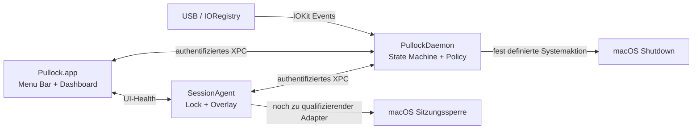
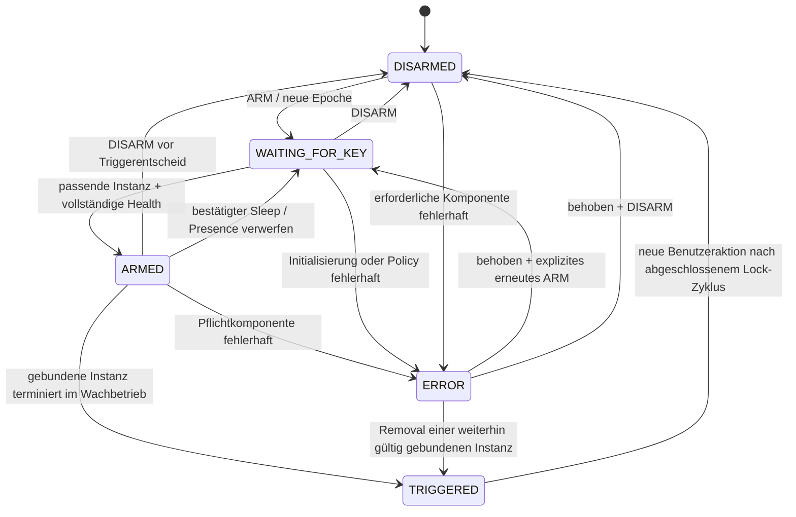

# Pullock — Architektur und Umsetzungsplan

Stand: 29. September 2026. **M4-Dienstdiagnose integriert; flüchtige Auswahl beliebiger USB-Geräte und öffentlicher Sperrtest beauftragt und implementiert. Noch kein qualifizierter automatischer Live-Schutz.**

**Aktuelle Produktentscheidung:** Der Nutzer wählt eine vorhandene USB-Verbindung, ohne Seriennummer oder Inhaltszugriff. Entfernung, Neustart, Sleep und Session-/Watcher-Wechsel erfordern erneute Auswahl. Der Nutzer hat Control–Command–Q mit macOS-Eingabeberechtigung und der ehrlichen Ergebnismeldung „Sperre angefordert“ freigegeben. [ADR 0003](docs/decisions/0003-connection-switch-and-shortcut.md) ersetzt dazu ältere Serial-/Lock-Entscheidungsgates in diesem historischen Plan. Reale Funktions-, System- und Distributionsprüfungen bleiben erforderlich.

Der Auftrag „starte den plan“ hat M1 freigegeben. Das native Diagnosewerkzeug unter `tools/hardware-harness` enthält ausschließlich Mock-Aktionen. Aktueller Nachweisstand: [M1-Bericht](docs/test-reports/M1.md), [API-Entscheidungen](docs/decisions/0001-m1-feasibility.md), [Supportmatrix](docs/compatibility/M1.md). Der nachfolgende Auftrag „immer weiter“ autorisiert die sichere Weiterarbeit ohne organisatorischen Stopp an jeder Meilensteingrenze. [ADR 0002](docs/decisions/0002-safe-continuation.md) und [M2-Bericht](docs/test-reports/M2.md) dokumentieren die Umsetzung. Die folgenden Planungsannahmen bleiben historische Ausgangslage, soweit diese Fortschrittsnotizen sie aktualisieren.

Zusätzlicher Auftrag: Sobald die erste nutzbare App ihre Build-, Sicherheits- und Distributionsprüfungen besteht, soll sie als GitHub Release mit Installationsartefakt, Prüfsumme und Release Notes veröffentlicht werden. Die Veröffentlichung ist damit bedingt autorisiert; eine erneute organisatorische Freigabe ist dann nicht nötig. Die reine Simulationsfassung ist kein fertiger Schutz-Release.

Produkt: native macOS Menu-Bar-App und Marketing-Website unter `pullock.app`.
Leitidee: **Key in. You’re safe. Key out. Mac locked.** Diese Formulierung ist ein Produktziel, keine bereits nachgewiesene Sicherheitsgarantie.

## 0. Auftrag, Ausgangslage und Entscheidungsregeln

Dieses Dokument hält die abgeschlossene Planungsphase und die weiteren Meilensteine fest. M1 ist untersucht, M2 als ungefährliche Entwicklungsbasis und der M3-Softwareaufbau sind umgesetzt. Die weitere sichere Implementierung ist inzwischen autorisiert; Live-Schutz- und Release-Nachweise bleiben erforderlich. M1 installiert keine Dienste, verändert keine Berechtigungen oder Geräte und führt keine realen Lock-/Shutdown-Aktionen aus.

Ergänzende Vorgaben: GitHub wird nach jedem überprüften, zusammenhängenden Arbeitsstand synchron gehalten. Die Website liegt im selben Repository und läuft auf **GitHub Pages**. Benötigte App-/Website-Grafiken werden im jeweiligen Meilenstein eigens erstellt, überprüft und mit ihren Quellen/Exporten versioniert.

Zu Beginn enthält das Repository `.gitattributes` und eine `LICENSE` mit dem GPL-v3-Lizenztext. Es gibt keinen Anwendungscode, keine Build-Konfiguration und keine gefundenen `AGENTS.md`-Anweisungen im Repository oder den geprüften übergeordneten Verzeichnissen. Die vorhandene Lizenz bleibt bestehen; Produkt- und Distributionsentscheidungen müssen dazu passen. GitHub-Repository: `koljasagorski/pullock.app`, öffentlich, Hauptbranch `main`. Die Pages-API liefert zum Planungszeitpunkt noch keine eingerichtete Site.

Lokal geprüft: Apple Silicon, macOS 27.0 (26A428), Xcode 27.0 (27A266a), Swift 6.4. Apple führt bereits macOS 27.0.1 (26A434) als Release vom 28. September 2026. Primäres Release-Ziel ist deshalb **macOS 27.x auf Apple Silicon**, getestet auf dem jeweils aktuellen stabilen Patchstand. Ältere Systeme werden nicht allein aufgrund der API-Verfügbarkeit als unterstützt beworben. [Apple: macOS 27.0.1](https://developer.apple.com/news/releases/?id=09282026c)

Die Anforderung endet nach Abschnitt 23 mit einem einzelnen „K“. Dieser Plan deckt den vollständig übermittelten Teil ab; ein eventuell fehlender Rest wird nicht erfunden.

Die nachfolgenden Angaben unterscheiden:

- **Belegt:** durch aktuelle offizielle Dokumentation beziehungsweise lokal ausgelieferte Apple-SDK-Header/Manuals nachgeprüft.
- **Entscheidung:** vorgeschlagene Produkt-/Architekturentscheidung, die mit der Planfreigabe angenommen werden kann.
- **Zu validieren:** Annahme mit Test und Freigabekriterium; keine zugesicherte Produkteigenschaft.

### 0.1 Die drei entscheidenden Machbarkeitsgrenzen

| Thema | Befund | Konsequenz |
| --- | --- | --- |
| Sofortige Sitzungssperre | In den geprüften öffentlichen Apple-APIs wurde keine belastbare, direkte API für eine beliebige lokale Sitzungssperre identifiziert. Ein öffentlicher API-Baustein zum Senden von Eingaben ist noch keine garantierte Sperrfunktion. | M1 und M5 müssen einen tragfähigen Sperrweg einschließlich Erfolgskriterium liefern. Ohne ihn kein Sicherheitsrelease und kein „Mac locked“-Versprechen. |
| Einen bestimmten YubiKey erkennen | VID/PID sind keine individuelle Identität. Die Verfügbarkeit einer stabilen Seriennummer im passiv lesbaren USB-/IORegistry-Datensatz muss pro Modell und Konfiguration geprüft werden. | Keine automatische Einschreibung ohne hinreichend stabile Identität. Fehlt sie bei den Zielgeräten, braucht das Produkt eine ausdrücklich freigegebene Änderung seines Identitätsmodells. |
| Physisches Abziehen gegenüber Reset | Eine IOService-Terminierung bestätigt das Ende einer Service-Instanz, nicht den mechanischen Grund. Ein aktiver Hub-/Bus-Reset kann wie Abziehen aussehen. | Kein Versprechen „sofortiges Shutdown bei jedem Abziehen und niemals Shutdown bei Reset“. Standard Lock; Shutdown gesondert aktivieren und nur für qualifizierte Konfigurationen anbieten. |

Diese Grenzen werden vor umfangreichem UI- und Website-Bau untersucht. Ein schöner Prototyp darf keine fehlende Schutzfunktion verdecken.

## 1. Produktarchitektur

Pullock besteht aus drei lokal laufenden nativen Prozessen und einer davon unabhängigen statischen Website:

| Bestandteil | Aufgabe | Privilegien |
| --- | --- | --- |
| `Pullock.app` | SwiftUI-Dashboard, Menu Bar, Onboarding, Settings, Enrollment, Diagnoseexport | Benutzerkontext |
| `PullockSessionAgent` | Sitzungsspezifischer Lock-Adapter, AppKit-Overlay, Überwachung von UI-/Daemon-Erreichbarkeit und Session-Lebenszyklus | Benutzerkontext, Aqua-Sitzung |
| `PullockDaemon` | Autoritative USB-Beobachtung, State Machine, Enrollment-/Policy-Speicher, Health-Aggregation, eng begrenzter Shutdown-Executor | System-LaunchDaemon, root |
| Website | Produktdarstellung, Kompatibilität, Download, Dokumentation | Keine Verbindung zur lokalen Schutzkette |



Die App löst keine Hardwareereignisse durch UI-Logik aus. Alle Oberflächen zeigen Projektionen desselben versionierten Daemon-Snapshots; die lokale Anzeige kann einen Snapshot bei Verbindungsverlust zusätzlich als ungültig markieren. Ein geschlossenes Hauptfenster beendet keinen Prozess und keinen Schutz.

Die Website nutzt Next.js, TypeScript und Tailwind CSS. Die native App verwendet Swift, SwiftUI, AppKit, IOKit, ServiceManagement und Foundation/Security. Kein Electron, keine WebView als App, keine Python-Laufzeit, kein Kernel-Treiber und keine eigene USB-Treiberübernahme.

MVP: ein Primary Key, USB-Verbindung, Lock und qualifiziertes optionales Lock + Shutdown. NFC, iPhone-Integration, Remote-Steuerung, Cloud, Account, Telemetrie, automatische Entsperrung und mehrere gleichzeitig autorisierte Keys gehören nicht zum MVP.

## 2. Threat Model

### 2.1 Schutzgut, Angreifer und Vertrauensgrenzen

Schutzgut ist die weitere interaktive Nutzung einer bislang entsperrten Mac-Sitzung nach dem Verlust der beobachteten USB-Verbindung. Pullock verwaltet keine YubiKey-Credentials. Es ersetzt weder FileVault noch die macOS-Authentisierung und verhindert keinen Diebstahl.

Angenommen werden ein intaktes macOS, aktive Plattform-Sicherheitsmechanismen und ein legitimer Benutzer, der Pullock bewusst installiert und scharfschaltet. Berücksichtigt werden Prozessabstürze, gewöhnliche lokale Prozesse einschließlich desselben UID, falsche USB-Geräte, fehlerhafte Hubs und Bedienfehler. Root-/Kernel-Kompromittierung, kompromittierte Signierschlüssel und ein vollständig kontrollierter WindowServer liegen außerhalb der durchsetzbaren Grenze.

USB-Deskriptoren sind **unvertrauenswürdige Eingaben** und keine kryptografische Geräteattestation. Ein Angreifer kann VID/PID und gegebenenfalls eine Seriennummer imitieren. Rein passive USB-Präsenzprüfung kann das nicht zuverlässig verhindern. Wenn Mac, Key und Verbindung zusammen entwendet werden, gibt es kein Removal-Ereignis.

Vertrauensgrenzen: USB → Parser; Benutzerprozess → root-XPC; Benutzerkonfiguration → root-Policy; UI-Snapshot → sichtbares Schutzversprechen; Release-Artefakt → installierter Dienst.

### 2.2 Bedrohungen und Gegenmaßnahmen

| Bedrohung / Fehler | Vorgesehene Reaktion | Verbleibende Grenze |
| --- | --- | --- |
| App-Absturz / GUI wird beendet | Daemon beobachtet weiter; Agent zeigt ERROR und fordert bei zuvor aktivem Schutz Lock an; kontrollierter Neustart | Ohne Agent kann keine Anzeige erscheinen. |
| SessionAgent stirbt oder hängt | Daemon erkennt Lease-Verlust; App zeigt ERROR; Agent-Neustart durch launchd qualifizieren | Sitzungssperre kann während der Lücke ausfallen; nie als geschützten Zustand ausgeben. |
| Helper-/Daemon-Absturz | Agent erkennt Verbindungsabbruch/Lease-Verlust, fordert bei vorherigem ARMED Lock an; Neustart beginnt ohne alte Presence-Evidenz | Kein Shutdown auf bloßen Ausfall oder beim Neustart; ein Removal während Totalausfall kann unbemerkt bleiben. |
| USB-Watcher initialisiert nicht / wird ungültig | ERROR, kein neues Arming; bei aktivem Schutz Lock-Fallback versuchen | Ein gültiges Handle beweist nicht die fehlerfreie Zukunft des USB-Stacks. |
| Spoofed USB device | Strikte Identitätsprüfung, Instanzbindung und Mehrdeutigkeitsprüfung | Deskriptor-Spoofing ist ohne Authentisierungsprotokoll nicht lösbar. |
| Zweiter YubiKey | Andere Seriennummer ignorieren; doppelte Identität blockiert Arming; Entfernung der gebundenen Instanz bleibt relevant | Keine Ersetzung durch „irgendeinen Yubico-Key“. |
| Bösartiger lokaler Prozess / IPC spoofing | OS-geprüfte Signaturanforderungen, feste Client-Rollen, Session-/UID-Prüfung, begrenzte Nachrichten | Signatur beweist Codeherkunft, nicht menschliche Absicht; ein kompromittierter zulässiger Client bleibt gefährlich. |
| Manipulierte Konfiguration | Sicherheitsdaten root-eigen, enges Schema, atomare Updates, Versionsprüfung | Root kann diese Grenze überschreiben. |
| Korrupte Preferences | UI-Werte sicher zurücksetzen; korrupte Schutz-Policy → ERROR | Niemals stillschweigend anderes Gerät oder Shutdown auswählen. |
| Sleep-/Wake-Race | Power-Epochen, frische Presence nach Wake, getestete Ereignisreihenfolgen | API-übergreifende Zustellreihenfolge muss auf Hardware qualifiziert werden. |
| Hub-/Bus-Reset | Aktiver Verbindungsverlust führt im Standardmodus zu Lock | Im expliziten Shutdown-Modus verbleibt ein Fehlshutdown-Risiko. |
| Helper-Freigabe entzogen | Status und echten IPC-Kontakt prüfen; ERROR; Session-Lock versuchen | Pullock umgeht die Systementscheidung nicht. |
| Update während ARMED | Erst kontrolliert disarmen, dann Update; erneute Health-Prüfung und manuelles Arming | Kein unterbrechungsfreies Schutzversprechen während Austausch. |
| Daemon-/Agent-/App-Version passt nicht | Unvereinbare Protokolle ablehnen, ERROR, keine neue Schutzsession | Keine Interpretation unbekannter Aktionen als Standardaktion. |
| Eingefrorene UI / CPU-Überlastung | Gegenseitige Heartbeats einschließlich UI-Fortschritt, lokale Freshness-Prüfung | Angehaltene Prozesse oder ein eingefrorener Compositor können keine rote Anzeige zeichnen. |
| Angreifer bedient entsperrte App | Scharfschaltung und Änderungen werden protokolliert; keine externen Disarm-URLs/CLI | Schutz gegen lokale Bedienung vor dem Ziehen benötigt eine zusätzliche Authentisierungspolitik; siehe offene Fragen. |

## 3. macOS-Sicherheitsarchitektur

### 3.1 Unterstützte Integrationspunkte

`SMAppService` ist Apples vorgesehener Weg ab macOS 13 für eingebettete Login Items, LaunchAgents und LaunchDaemons. Registrierung und Benutzer-/Admin-Freigabe sind getrennte Schritte. Insbesondere startet ein neu registrierter Daemon erst nach Admin-Freigabe. Ein erfolgreicher Registrierungsaufruf allein bedeutet nicht „Helper gesund“. `status`, tatsächlicher XPC-Handshake, Protokollversion und ausführbarer Health-Check müssen übereinstimmen. [Apple: SMAppService](https://developer.apple.com/documentation/servicemanagement/smappservice), [Apple: register()](https://developer.apple.com/documentation/servicemanagement/smappservice/register())

Entscheidung: `SMAppService.daemon(plistName:)` und `.agent(plistName:)`; Main-App-Autostart bei Bedarf über `.mainApp`. Kein `SMJobBless` als neue Architektur, kein manuelles Kopieren von launchd-Plists anstelle von SMAppService. LaunchAgent-Registrierung erfolgt pro Benutzer; das MVP unterstützt einen konfigurierten Schutzbenutzer.

Hardened Runtime und Developer-ID-Signierung sind vorgesehen. Die Distribution erfolgt direkt außerhalb des Mac App Store. App Sandbox wird für diese systemweite MVP-Architektur zunächst nicht vorausgesetzt; das rechtfertigt keine zusätzlichen TCC-Berechtigungen. Kein Full Disk Access, Screen Recording oder Input Monitoring ohne nachgewiesene Notwendigkeit. Accessibility/Event-Posting ist ausschließlich eine mögliche, noch nicht freigegebene Lock-Alternative.

Apple-Silicon-MacBooks können USB-/Thunderbolt-Zubehör erst nach Benutzerfreigabe verfügbar machen. Onboarding erklärt diesen Zustand, behandelt fehlende Sichtbarkeit als WAITING und ändert keine systemweite Zubehör-Sicherheitseinstellung. [Apple: Zubehörfreigabe](https://support.apple.com/en-gb/102282)

### 3.2 Grenzen eines Sicherheitsversprechens

Root-Rechte geben dem Daemon keine Aqua-Sitzung und keine pauschale TCC-Freigabe. Er darf weder ein eigenes schwarzes Fenster als Lock ausgeben noch loginwindow-/Authentisierungsdatenbanken manipulieren. Die öffentliche Lock-Fähigkeit und deren verlässliche Beobachtung sind separate Release-Gates.

„Grün“ bedeutet: alle spezifizierten und überprüfbaren Voraussetzungen des qualifizierten Betriebsprofils sind gerade erfüllt. Es bedeutet keine beweisbare zukünftige Ausführung bei einem beliebigen OS-/Hardwarefehler. Ohne tragfähigen Lock-Pfad darf auch ein technisch funktionierender USB-Demoaufbau niemals ARMED/PROTECTED anzeigen.

## 4. Prozess- und Privilege-Architektur

### 4.1 Warum der Daemon selbst beobachtet

Ein ausschließlich unprivilegierter Watcher wäre durch denselben Benutzer leicht beendbar und würde die ganze Triggerkette unterbrechen. Deshalb liegen die kleine IORegistry-Beobachtung und der deterministische Zustandskern im Daemon. Das ist ein bewusster Least-Privilege-Kompromiss: etwas mehr root-Code, dafür keine Abhängigkeit der Erkennung von GUI-/Agent-Lebensdauer.

Der Daemon enthält keine UI, Netzwerk-Clients, Plugin-Lader, frei konfigurierbaren Prozesse oder allgemeinen Dateibrowser. Nicht benötigte Frameworks bleiben außerhalb seines Targets. USB-Eingaben und XPC-Nachrichten erhalten Längen-, Typ- und Mengenbegrenzungen. Eine spätere Aufteilung in unprivilegierten Sensor und minimalen root-Executor bleibt möglich, wenn deren Ausfallmodell die zugesagte Funktion tatsächlich trägt.

Die Komponenten liegen im signierten App-Bundle. Vorgesehen sind `Contents/Library/LaunchDaemons`, `Contents/Library/LaunchAgents` und dedizierte ausführbare Dateien mit festen Bundle-relativen Pfaden. Die genaue SMAppService-Bundle-/Plist-Struktur, launchd-Neustartregeln, Ownership und Verschiebeverhalten werden mit einem minimalen signierten Build verifiziert. Apples Beispiel begründet die Bündelung im signierten Paket. [Apple: ServiceManagement-Paketstruktur](https://developer.apple.com/documentation/servicemanagement/updating-your-app-package-installer-to-use-the-new-service-management-api)

### 4.2 Konfiguration und Lebenszyklus

- Schutzkonfiguration: `/Library/Application Support/Pullock/`, root-eigen, Verzeichnis `0700`, Dateien `0600`; kein Schreiben durch die App direkt.
- Gespeichert: Schema-Version, Enrollment-ID, Identitätsmerkmale, Owner-UID, Policy-Version, freigegebener Aktionsmodus und letzte Diagnosezustände. Keine Schlüssel, PINs, OTP-Seeds, Passkeys oder Zugangsdaten.
- UI-Preferences: Benutzerkontext, nur Darstellung. Ein manipuliertes Overlay-Setting darf die Schutz-Policy nicht ändern.
- Sicherheitsänderungen ausschließlich als validierte Transaktion über XPC, nur disarmed; Erfolg erst nach Daemon-Bestätigung anzeigen.
- Atomare Dateiersetzung innerhalb des eigenen Verzeichnisses, restriktive Ownership-Prüfung und kein Folgen fremder Symlinks. Dateipfade werden nicht vom Client geliefert.
- `seenKeySinceArming`, Registry-Instanzen und aktive Triggerberechtigung werden nicht über Reboot/Daemon-Neustart wiederhergestellt.
- Start im Erstsetup: DISARMED. Bei später ausdrücklich aktivierter Startabsicht: WAITING, immer mit frischer Presence-Evidenz. Standard bleibt manuelles Arming.
- `Quit` bei aktivem Schutz verlangt eine klare Disarm-&-Quit-Entscheidung. Ein Crash oder Fremd-Kill gilt nicht als Disarm.
- Uninstall: disarmen, Dienste über SMAppService deregistrieren, Ergebnis prüfen, nur eigene Dateien nach gewählter Datenlöschung entfernen. Kein globales Zurücksetzen der macOS-Background-Items-Datenbank.

## 5. USB-Erkennung

### 5.1 Ereignisquelle

Primär wird per User-Space-IOKit auf physische `IOUSBHostDevice`-Service-Instanzen gematcht. `IOServiceAddMatchingNotification` mit `kIOFirstMatchNotification` und `kIOTerminatedNotification` liefert Auftauchen und Terminierung. Es werden keine HID-/CCID-/FIDO-Interfaces exklusiv geöffnet und keine USB-Kommandos an den Key geschickt. Die IORegistry reicht nur soweit, wie das Betriebssystem Eigenschaften bereits bereitstellt.

Apple dokumentiert: Terminierung ist eine Service-Terminierung; Iteratoren müssen vollständig geleert werden, damit Benachrichtigungen scharf sind. Das gilt auch unmittelbar nach Registrierung. Matching-Dictionaries haben Ownership-Regeln und dürfen nicht unkontrolliert mehrfach weitergegeben werden. [Apple: IOServiceAddMatchingNotification](https://developer.apple.com/documentation/iokit/1514362-ioserviceaddmatchingnotification)

Implementierungsregeln für M3:

1. Power-Beobachtung und USB-Notification-Port aufsetzen; moderne SDK-Symbole wie `kIOMainPortDefault` verwenden, nicht alte Beispiele unverändert übernehmen.
2. Attach- und Termination-Registrierung auf derselben seriellen Verarbeitungslinie installieren; für jede Registrierung eigenes korrekt verwaltetes Matching-Dictionary. M1-Befund: Bei `IOUSBHostDevice` Herstellerfilter unter `kIOPropertyMatchKey` setzen; ein Top-Level-`idVendor` fand auf dem untersuchten System den vorhandenen Key nicht.
3. Beide Initial-Iteratoren vollständig drainen und bestehende Instanzen erfassen. Während Bootstrap keine Schutzaktionen zulassen.
4. Einmalige Bestandsabstimmung nach Registrierung, dann Readiness veröffentlichen. Doppel- und gegenläufige Events über Registry-ID/Epoche deduplizieren. `IOServiceGetMatchingServices` darf laut SDK bei Erfolg einen Null-Iterator für einen leeren Bestand liefern; dies ist kein Watcher-Fehler.
5. `IONotificationPortSetDispatchQueue` für Zustellung; Callback erzeugt begrenzten Event-Wert, die State Machine verarbeitet ihn geordnet.
6. Identität bei Attach cachen. Nach Termination nicht darauf vertrauen, dass Deskriptoren noch lesbar sind.
7. Device-Instanz statt einzelner Composite-Interfaces verfolgen. FIDO-, OTP- und CCID-Unterobjekte dürfen nicht drei voneinander unabhängige Keys erzeugen.
8. Fehlercodes und Iteratorgültigkeit berücksichtigen; IOKit-Objekte, Iteratoren und Notification-Port eindeutig freigeben.

Keine periodischen `system_profiler`-/`ioreg`-Aufrufe, keine periodische Geräte-Vollsuche. Initiale Enumeration und ereignisbedingte Reconciliation nach Wake/Watcher-Neustart sind erlaubt. Watchdog-Timer prüfen Prozessfortschritt, nicht durch Polling die USB-Präsenz.

### 5.2 Semantik und Latenz

`attached` bedeutet neue Service-Instanz; `removed` bedeutet Terminierung der gebundenen Instanz; `reappeared` bedeutet neue Instanz, deren Identität erneut geprüft wurde. `reappeared` hebt einen Trigger nicht auf.

Zielwerte, noch ungemessen: Callback-Eingang → atomarer Triggerentscheid p95 ≤ 10 ms, p99 ≤ 50 ms auf qualifizierter Hardware. Keine künstliche Reconnect-Gnadenfrist im normalen Wachzustand. Shutdown und Logging dürfen die Lock-Anforderung nicht verzögern.

Physischer Kontaktverlust → OS-Callback und Callback → tatsächlicher Sperrbildschirm sind getrennte Messgrößen. macOS ist kein Echtzeitsystem. Ein interner Zeitstempel beweist nicht die Latenz seit dem mechanischen Abziehen; hierfür sind ein externer USB-Testaufbau oder zeitlich kalibrierte Video-/Hardwaremessungen erforderlich. Messmethode, Auflösung, Last und Ausreißer werden mit veröffentlichten Zahlen genannt.

## 6. Geräteidentifikation und Enrollment

Yubico verwendet VID `0x1050`; die PID hängt von Modell und aktiven Interfaces ab. Die Herstellerdokumentation unterscheidet außerdem USB-Transport, Interfaces und per Management-Anwendung ausgelesene Geräteinformationen. Eine dort verfügbare Seriennummer ist nicht automatisch als USB-Deskriptor verfügbar. [Yubico: YubiKey Concepts](https://developers.yubico.com/Mobile/Concepts.html)

### 6.1 Datenmodell

| Feld | Zweck | Keine Verwendung als |
| --- | --- | --- |
| Enrollment-UUID | Lokaler Datensatzschlüssel | USB-Identitätsbeweis |
| Hersteller / VID | Kompatibilitätsfilter | Individuelle Identität |
| PID + beobachtete Varianten | Modell-/Interface-Kompatibilität | Einziges Matching-Kriterium |
| Seriennummer mit Quelle und Qualitätsstatus | Individuelle Wiedererkennung, soweit tatsächlich stabil verfügbar | Kryptografische Echtheitsbestätigung |
| Produktstring, Geräteklasse, Interface-Zusammenfassung | Plausibilität, Anzeige, Diagnose | Verlässliche Seriennummer-Ersatzlösung |
| Transport `USB` | Verhindert Verwechslung mit NFC/anderem Transport | Gerätenachweis |
| Registry-Entry-ID + Watcher-Epoche | Laufende physische Service-Instanz binden | Persistente Identität über Reconnect/Boot |
| Location-/Port-/Hub-Information | Fehlersuche, qualifizierte Verbindungstopologie | Individuelle Key-Identität |

Die konkrete Eigenschaftsauflösung berücksichtigt die aktuellen SDK-Konstanten, unter anderem `kUSBHostDevicePropertySerialNumberString`, sowie tatsächlich beobachtete Registry-Eigenschaften. Nicht blind eine einzelne Zeichenkette aus älteren Beispielen festschreiben. Strings begrenzen, Typen validieren, konservativ normalisieren und als private Daten behandeln; keine zwei verschiedenen Seriennummern durch aggressive Normalisierung zusammenführen.

### 6.2 Ablauf und Matching-Regeln

1. Nur aktuelle unterstützte USB-Geräte anbieten, deren Daten der Daemon selbst gelesen hat.
2. Nutzer wählt eine konkrete Instanz; Modell und maskierte Seriennummer anzeigen, Quelle/Qualität bei Bedarf erklären.
3. Im ungefährlichen Detection-Test Abziehen/Wiedereinstecken prüfen. Stabile Wiedererkennung und Abgrenzung gegen einen zweiten Key nachweisen.
4. Enrollment erst disarmed und nach vollständiger Prüfung atomar speichern.
5. Wiedererkennung erfordert VID, akzeptierte Gerätefamilie, USB-Transport und exakte stabile individuelle Kennung. Bekannte PID-Varianten derselben Familie dürfen wechseln.
6. Unbekannte PID/Interface-Konfiguration mit gleicher Seriennummer nicht stillschweigend zulassen: disarmed prüfen, Kompatibilitätsdaten aktualisieren oder erneut registrieren. Konfigurationswechsel während ARMED kann eine Terminierung auslösen.
7. Beim Arming genau eine passende Instanz binden. Kommt ein Duplikat hinzu, Health → ERROR und Lock-Fallback; die ursprüngliche Instanzbindung bleibt bestehen.

**Fehlende oder instabile Seriennummer:** Der strikte MVP lehnt persistentes spezifisches Enrollment ab und erklärt den Grund. Keine Ersatzidentität aus VID+PID+Port und keine von Hand eingetippte, technisch nicht vergleichbare Seriennummer.

Falls Ziel-YubiKeys dadurch praktisch nicht unterstützt werden, ist dies ein Produktblocker. Beste Alternativen zur ausdrücklichen Entscheidung: ein klar bezeichneter, manuell gewählter Key nur für die aktuelle Attach-Session ohne automatische Wiedererkennung; oder eine eng begrenzte Hersteller-Abfrage beim Enrollment mit neuer Prüfung des Interferenz-/Privacy-Versprechens. Beide verändern Anforderungen und werden nicht still implementiert. Eine kryptografische Challenge würde das reine Präsenzmodell weiter verändern.

Provider-Schnittstellen für spätere andere Hersteller und ein versionierter Satz zulässiger Enrollment-IDs werden vorbereitet. Backup-/Mehrfach-Key-Semantik wird noch nicht aktiviert; insbesondere keine unklare „einer von vielen“-Removal-Regel.

## 7. State Machine

### 7.1 Autorität und Invarianten

Ein einzelner deterministischer Reducer im Daemon verarbeitet USB, Power, Health und Benutzerbefehle sequenziell. Seiteneffekte laufen außerhalb des Reducers. Bei Swift Concurrency darf zwischen Guard-Prüfung und Zustandsänderung kein `await` eine Reentrancy-Lücke öffnen. Alle Events tragen monotone Sequenznummer, Watcher-/Power-/Arming-Epoche und Herkunft.

Mindestens vorhandene öffentliche Zustände: `DISARMED`, `WAITING_FOR_KEY`, `ARMED`, `TRIGGERED`, `ERROR`. Ergänzende Felder: `armIntent`, `seenKeySinceArming`, gebundene Instanz, `health`, `powerPhase`, Aktionsmodus, Trigger-ID, Aktionsfortschritt und Fehlergrund.

Invarianten:

- Ohne positive Presence innerhalb der aktuellen Arming-/Watcher-/Power-Epoche kann eine fehlende Instanz keinen Removal-Trigger erzeugen.
- `ARMED` setzt passende eindeutige Instanz, gesunde Pflichtkomponenten, freigegebenen Aktionspfad und aktive Owner-Sitzung voraus.
- Pro Arming-Epoche höchstens ein Triggerentscheid. Alte/duplizierte Events werden verworfen.
- `TRIGGERED` ist verriegelt. Reconnect und verspätetes Disarm brechen Lock/Shutdown nicht ab.
- Ein Health-Fehler macht die Anzeige rot, hebt aber eine bereits bestehende Removal-Berechtigung nicht automatisch auf. Der Daemon behält eine noch gültige gebundene Instanz und kann deren späteres Removal weiterhin behandeln.
- Neue Scharfschaltung nach Fehlerbehebung erfordert eine explizite Bestätigung. Kein automatisches Grün nach einem Reconnect bei unbekannter Historie.



### 7.2 Ereignistabelle

| Ereignis | Voraussetzung | Ergebnis / Effekt |
| --- | --- | --- |
| Erststart ohne Key | Keine Arm-Absicht | DISARMED; keinerlei Schutzaktion |
| ARM ohne Key | Konfiguration/Komponenten funktionsfähig | WAITING, `seenKeySinceArming = false` |
| ARM mit vorhandenem Key | Frisch validierter Snapshot | Über WAITING zu ARMED, Instanz binden |
| Termination ohne vorherige Presence | WAITING/Bootstrap | Bestand aktualisieren; kein Trigger |
| Anderes USB-Gerät entfernt | Keine gebundene Instanz | Kein Schutzeffekt |
| Gebundener Key entfernt | Aktive Epoche, positiver Presence-Nachweis, zulässige Power-Phase | TRIGGERED, Lock zuerst anfordern, optional Shutdown unabhängig anfordern |
| Attach unmittelbar nach Removal | Trigger bereits entschieden | Bleibt TRIGGERED |
| Disarm und Removal konkurrieren | Beide gültig | Reihenfolge im Reducer entscheidet; UI meldet Disarm erst nach Commit |
| Pflichtkomponente fällt aus | Vorher ARMED | ERROR; Lock-Fallback versuchen; kein Shutdown allein wegen Ausfall |
| Daemon startet neu | Persistierte Policy vorhanden | Keine alte Presence übernehmen; ERROR-Hinweis/WAITING nach bewusster Wiederaufnahme |
| Wake | Neue Power-Epoche | WAITING; frische Enumeration, nie Removal aus Abwesenheit ableiten |

Crash-Konsistenz: „höchstens einmal“ gilt für den lebenden Reducer, nicht als verteiltes Exactly-once-Versprechen über Abstürze hinweg. Ein Diagnose-Triggerjournal darf nach Neustart keinen Shutdown erneut abspielen. Unbekannter Aktionsausgang wird als unbekannt ausgewiesen. Das vermeidet gefährliche Startup-Replays, akzeptiert aber eine dokumentierte Schutzlücke bei Daemon-Absturz im Triggerzeitpunkt.

## 8. IPC-/XPC-Konzept

Entscheidung: `NSXPCConnection`/`NSXPCListener` mit eng typisiertem Protokoll. Die aktuelle öffentliche Methode `setCodeSigningRequirement(_:)` existiert seit macOS 13 und wird vor Aktivierung der Verbindung gesetzt; API und Verfügbarkeit wurden zusätzlich im lokalen SDK geprüft. Auf Listener-Seite wird die entsprechende Signaturanforderung vor Annahme von Nachrichten eingerichtet. Low-Level-XPC und seine neueren Peer-Requirements bleiben eine Alternative, falls ein konkret nachgewiesener Bedarf besteht. [Apple: NSXPCConnection](https://developer.apple.com/documentation/foundation/nsxpcconnection/setcodesigningrequirement(_:)), [Apple DTS: Signaturprüfung](https://developer.apple.com/forums/thread/681053)

### 8.1 Authentisierung und Autorisierung

- Erwartet werden Apple-verankerte Developer-ID-Signatur, konkrete Team-ID und exakte zugelassene Signing-Identifier. „Gleiche Team-ID“ allein ist zu breit.
- Getrennte Rollen für Main App und SessionAgent; Agent darf keine neue Geräteidentität oder beliebige Shutdown-Policy setzen.
- Daemon-Endpunkt im System-Mach-Namespace mit privilegierter Verbindungsoption; kein zufällig gleichnamiger Benutzer-Service.
- OS-abgeleitete UID/Session-Zuordnung vor Dispatch erfassen und mit der konfigurierten aktiven Owner-Sitzung abgleichen. Behauptete UID im Payload ist keine Autorität. PID allein ist kein Signaturnachweis.
- Antworten und Agent-Callbacks werden ebenfalls geprüft. Nach Connection-Replacement erneuter Handshake; alte Requests/Nonces gelten nicht weiter.
- Keine Release-Ausnahme für ad-hoc-signierte Clients. Entwicklung und Produktion haben getrennte IDs, Endpunkte und harmlose Ausführungsprofile.
- Schema, Enum-Werte, Klassen-Allowlist bei `NSSecureCoding`, Nachrichtengröße, Rate, Deadline, Sequenz und Policy-Version werden geprüft.

Wichtige Einschränkung: Peer-Signaturprüfungen kontrollieren empfangene Nachrichten; ein ausgehender erster Request kann einen falschen Empfänger erreichen. Ein erfolgreicher API-Aufruf ist kein gegenseitiger Vorabnachweis. Deshalb zunächst ein nicht sensitiver Health-/Versions-Handshake, System-Namespace, serverseitige Client-Prüfung und keine Geheimnisse im IPC. Auch danach bleibt root außerhalb der Abwehrgrenze. [Apple DTS: ausgehende XPC-Nachrichten](https://developer.apple.com/forums/thread/837286)

### 8.2 Enges Protokoll

| Operation | Rolle | Prüfung |
| --- | --- | --- |
| `getHealth` / `subscribeState` | App, Agent | Authentisierter Client, Version, begrenzte Subscriberzahl |
| `listCandidates` / `enroll(candidateID, revision)` | App | Disarmed, aktuelle vom Daemon erfasste Instanz, Owner-Sitzung |
| `setPolicy(policy, expectedRevision)` | App | Disarmed, bekannte Werte, explizite Auswahl des Shutdown-Modus |
| `arm(expectedRevision)` / `disarm(epoch)` | App | Aktiver Owner, Zustandsprüfung, atomarer Commit |
| `sessionHeartbeat` / `uiHealth` | App, Agent mit eigener Rolle | Sequenz, Sitzung, Boot-/Connection-Epoche, gemessener Fortschritt |
| `performLock(triggerID, epoch)` | Daemon → Agent | Authentisierter Daemon, gültige Sitzung, idempotente Verarbeitung |
| `requestTest(kind, oneTimeConsent)` | App | Harmlose Tests separat; echte Aktionen nur mit konkreter kurzlebiger Testfreigabe |

Es gibt **keine** öffentliche generische `executeShellCommand`, keinen frei wählbaren Pfad, keine argv-Strings und kein ungebundenes `shutdown()` für beliebige Clients. Die reale Shutdown-Funktion ist intern an einen validierten Removal-Trigger oder einen speziell freigegebenen manuellen Shutdown-Test gebunden. Ein Client kann keine angeblichen USB-Removal-Events in den Produktions-Daemon einspeisen.

XPC-Fehler und Timeouts sind Werte im Zustandsmodell. Reconnect nutzt begrenztes Backoff und erzeugt weder automatisches Disarm noch automatisches Grün. Signierter Code ist kein Beweis für einen menschlichen Klick; Schutz gegen missbrauchte UI-Automation erfordert eine gesonderte Benutzer-Authentisierungspolitik.

## 9. Shutdown- und Lock-Konzept

### 9.1 Lock: explizites Machbarkeits-Gate

Die Recherche und Prüfung der relevanten öffentlichen SDK-Header haben keine direkte, zuverlässig zugesicherte lokale „Lock this session now“-API ergeben. Das ist ein dokumentierter Recherchebefund, kein Beweis, dass Apple niemals einen geeigneten Mechanismus bereitstellt. M1 prüft das Ziel-SDK weiter; falls nötig wird eine konkrete Apple-DTS-/Feedback-Frage vorbereitet. Externe Anfragen werden nicht ohne gesonderten Auftrag versendet.

| Ansatz | Bewertung |
| --- | --- |
| Direkte dokumentierte Sitzungssperre | Bevorzugt, falls im aktuellen SDK/DTS geklärt; bisher nicht belegt |
| Öffentliche Event-Posting-/Accessibility-APIs und System-Lock-Aktion | Öffentliche Bausteine, aber zusätzliche Freigabe und mögliche Abhängigkeit von Tastaturbelegung, UI, Secure Input oder Session; nur als separat zu qualifizierende Alternative |
| `CGSession -suspend` aus internen Systempfaden | Keine belastbare aktuelle öffentliche Produktschnittstelle nachgewiesen; nicht als Standard festlegen |
| `SACLockScreenImmediate`, private Frameworks, private Notifications | Nicht freigegeben |
| Bildschirm ausschalten / Screensaver starten | Keine gleichwertige Sitzungssperre; hängt unter anderem von Systemrichtlinien ab |
| Apple Device Management `DeviceLock` | Dokumentierter Management-Befehl, aber kein lokaler Consumer-App-Lock-Adapter; würde Enrollment-/Management-Architektur ändern |
| Eigenes Overlay / loginwindow beenden | Kein akzeptabler Ersatz für eine native Sperre |

Apple dokumentiert Control-Command-Q als Benutzeraktion und öffentliche Berechtigungsabfragen für Event Posting. Daraus folgt keine garantierte Lock-Semantik für synthetische Events. [Apple: Tastaturkurzbefehle](https://support.apple.com/en-ie/102650), [Apple: CGPreflightPostEventAccess](https://developer.apple.com/documentation/coregraphics/cgpreflightposteventaccess()), [Apple: DeviceLockCommand](https://developer.apple.com/documentation/devicemanagement/devicelockcommand)

Der Adapter meldet getrennt `requestSubmitted`, `confirmedLocked`, `failed` oder `unknown`. Ein erfolgreiches Senden oder Verschwinden der Desktop-Sicht bestätigt nicht automatisch eine Sperre. Private Distributed Notifications und undokumentierte CGSession-Dictionary-Schlüssel gelten nicht als belastbare Bestätigung. EndpointSecurity-Sperrevents wären eine gesonderte Entitlement-/Systemintegrationsentscheidung und werden nicht einfach vorausgesetzt.

**Abnahme:** Sitzung erfordert nach dem Trigger wieder die native macOS-Authentisierung; Modal-, Fullscreen-, Last-, Sprach-/Layout-, Berechtigungsentzug- und Sessionwechsel-Fälle bestehen. Solange ein zuverlässiger Adapter beziehungsweise ein ehrliches eingeschränktes Betriebsprofil fehlt, bleiben reale Schutzmodi gesperrt. Beste Alternative bei ausbleibendem Nachweis ist eine ausdrücklich enger gefasste, unterstützte Produktfunktion; keine private API als stiller Ersatz.

### 9.2 Privilegierter Shutdown

Die auf macOS 27.0 ausgelieferte Manual Page `shutdown(8)` dokumentiert `/sbin/shutdown -h now`: Abschalten über den System-Shutdown-Pfad und launchd; Prozesse erhalten SIGTERM und später SIGKILL mit absichtlich nicht festgelegtem Abstand. Das unterscheidet sich vom normalen App-Beenden mit Save-Dialog. Die lokale `reboot(2)`-Dokumentation rät anderen Programmen vom direkten Systemaufruf ab und verweist auf `shutdown(8)` oder höhere APIs. Die ältere Apple-Webkopie wird nur ergänzend verwendet, nicht als aktueller Verfügbarkeitsnachweis. [Apple-Archiv: reboot(2)](https://developer.apple.com/library/archive/documentation/System/Conceptual/ManPages_iPhoneOS/man2/reboot.2.html)

Entscheidung: kleiner interner Executor, der das OS-eigene `/sbin/shutdown` mit **festen** Argumenten `-h`, `now` über `posix_spawn` oder gleichwertigen nativen Prozessstart aufruft. Kein Shell-Interpreter, kein `sudo`, kein Benutzer-PATH, keine benutzerdefinierte Umgebung und keine aus IPC übernommenen Argumente. Das ist eine eng begrenzte Systemintegration, keine Shell-basierte USB-Überwachung.

Keine `-n`-/No-Sync-Eskalation, kein direkter `reboot(RB_HALT)`, kein Töten beliebiger Prozesse und kein Hardware-Poweroff-Hack. Ein normales Benutzerprogramm soll den qualifizierten System-Shutdown nicht per Termination-Veto verhindern können; Endzeit, Kernel-Hänger oder garantiertes physisches Stromlossein werden nicht versprochen. Ungespeicherte Daten können verloren gehen.

### 9.3 Triggerablauf

1. Reducer verriegelt `TRIGGERED`, erzeugt Trigger-ID und friert den gewählten Modus ein.
2. Lock-Anforderung geht sofort über die bereits aufgebaute Agent-Verbindung auf ihren eigenen Ausführungspfad.
3. Bei Lock + Shutdown startet der Daemon unmittelbar danach den unabhängigen Shutdown-Pfad. Er wartet weder auf Lock-ACK noch auf UI/Logging.
4. Fehler und Bestätigungen beider Pfade werden getrennt erfasst. Shutdown-Fehler löst keine Entsperrung aus; ein bereits erfolgreicher Lock bleibt bestehen.
5. Ein gescheiterter Lock wird niemals als erfolgreich ausgegeben, auch wenn Shutdown angefordert wurde. Begrenzte Lock-Wiederholung bei transientem Fehler ist zulässig; kein unbegrenzter Retry-Sturm.
6. Reconnect, UI-Klick oder Agent-Reconnect können den beschlossenen Trigger nicht stornieren. Nach erfolgreichem Lock und bewusster Benutzer-Rückkehr ist erneutes Arming erforderlich.

„Mac bleibt gesperrt, wenn Shutdown scheitert“ ist damit an einen tatsächlich erfolgreichen Lock gebunden. Der Plan kann diese Eigenschaft vor Lösung des Lock-Gates nicht garantieren. Ein Shutdown-Prozess-Exitcode wird ebenfalls nicht als Nachweis für abgeschlossene Abschaltung ausgegeben.

Standardauswahl im Onboarding: **Lock**. Lock + Shutdown wird erst nach bestandenem Lock-Test, qualifizierter Verbindung und ausdrücklich bestätigtem Datenverlustrisiko aktiviert. Dies ist eine bewusste Sicherheitsentscheidung gegenüber einer vorgewählten destruktiven Aktion.

## 10. Fail-safe, Power-Ereignisse und Health Monitoring

### 10.1 Sleep, Wake und Verbindungsverlust

Der Daemon verwendet `IORegisterForSystemPower`; der Agent ergänzt Session-/NSWorkspace-Ereignisse. Die lokalen aktuellen Apple-Header verlangen eine zeitnahe Bestätigung bestimmter Power-Ereignisse mit `IOAllowPowerChange`. `willSleep` kommt vor dem Abschalten der Hardware; `willPowerOn` bedeutet noch nicht, dass diese benutzbar ist. Nach `hasPoweredOn` wird neu abgeglichen. Keine I/O-schwere Arbeit in frühen Wake-Callbacks, kein künstliches Verhindern von Sleep. Die Registrierung liefert selbst keine Shutdown-/Restart-Benachrichtigungen. [Apple: Power-Notifications](https://developer.apple.com/documentation/iokit/1557132-ioderegisterforsystempower)

| Situation | Verhalten |
| --- | --- |
| Bestätigter System-Sleep | Power-Epoche wechseln; ARMED verlassen; alte Presence ungültig; kein Shutdown aus Sleep-bedingtem USB-Abbau |
| Wake, richtiger Key vorhanden | WAITING, Watcher/Session/Identität/Health neu validieren; nach normalem Sleep bei fortbestehender Arm-Absicht frisch scharfschalten |
| Wake, Key fehlt | WAITING; kein fiktives Removal und kein Shutdown; Lock-Fallback für zuvor aktiven Schutz anfordern, wenn Sitzung nutzbar und Lock-Adapter verfügbar |
| Display-Sleep | Kein pauschaler USB-Schutz-Stopp; nur tatsächlicher System-Power-Wechsel eröffnet die Sleep-Epoche |
| Dark Wake / noch keine aktive Sitzung | Kein GUI-Lock-Erfolg behaupten; keine Scharfschaltung vor vollständiger Session-Readiness |
| Hub-/Dock-Abziehen im Wachzustand | Als Verlust der gebundenen Verbindung behandeln, einschließlich aller Geräte hinter dem Hub |
| Bus-Reset im Wachzustand | Nicht zuverlässig vom Abziehen zu unterscheiden; im Lock-Modus Lock, im expliziten Shutdown-Modus mögliches Shutdown |
| Fast User Switching | Alte Schutzsession verlassen und eigene Sitzung soweit möglich sperren; kein systemweiter Shutdown aufgrund fremder Benutzeraktivität; Wiederaufnahme nach erneuter Prüfung und bewusstem Arming |
| Logout / laufendes OS-Shutdown | Schutzsession kontrolliert beenden, kein rekursiver Trigger aus erwarteter Teardown-Sequenz; Signalquelle und Reihenfolge in M1/M8 qualifizieren |

Die Power- und USB-Quellen besitzen keinen hier belegten gemeinsamen totalen Zustellvertrag. Das Serialisieren verhindert eigene Datenrennen, beweist aber nicht die physische Ereignisreihenfolge. Tests müssen insbesondere „Termination-Callback schon queued, willSleep noch nicht verarbeitet“ abdecken. Normale Sleep-Zyklen dürfen keine destruktiven Aktionen auslösen. Bleibt ein nicht akzeptabler Race bestehen, wird **Lock + Shutdown für dieses Betriebsprofil nicht ausgeliefert**; Lock kann bei Unsicherheit weiterhin die sicherere Reaktion sein.

Ein Reconnect-Debounce würde Fehltrigger reduzieren, aber eine absichtliche Schutzlücke schaffen. Er wird nicht heimlich eingebaut. Topologieänderungen erfordern erneute Qualifikation für Shutdown; eine getestete Dock-Serie ist keine Garantie gegen jeden späteren Hardwarefehler.

### 10.2 Health statt Prozessliste

Ein Health-Snapshot enthält tatsächliche Statuswerte, Gründe, Sequenz, Boot-/Connection-Epoche, Erzeugungszeit, Empfängerzeit und Ablaufzeit. Mindestens geprüft werden:

- Main App und ihr UI-Eventloop machen Fortschritt.
- Monitoring-Daemon und sein serialisierter Zustands-/USB-Verarbeitungspfad reagieren.
- Privilegierter Executor ist im erwarteten Build vorhanden, Policy gültig und Dienstfreigabe wirksam.
- SessionAgent und verfügbarer Lock-Adapter gehören zur aktiven Owner-Sitzung.
- USB-Watcher initialisiert, beide Notifications aktiv und aktuelle Enumeration konsistent.
- Registrierte Identität geladen, genau der passende gebundene Key vorhanden.
- Aktionsmodus freigegeben, Trigger tatsächlich ARMED und keine offene Power-/Recovery-Phase.
- XPC-Handshake, Versionen und Heartbeats gültig.

Entwurfswerte: Heartbeat etwa 1 s, Ablauf nach 3 s ohne gültigen Fortschritt, bei XPC-Invalidation sofort lokal ungültig. Monotone Uhr und injizierbare Clock; nach Sleep kein blindes Auswerten überalterter Fristen. Die Zahlen sind zu messen und keine Echtzeitgarantien. Heartbeats passieren die relevanten Queues; ein separater Ping-Thread allein darf einen festhängenden Watcher nicht als gesund melden.

Health-Prüfungen führen keinen echten Shutdown und keine kontinuierlichen echten Locks aus. Ein Preflight belegt Voraussetzungen, nicht den späteren physischen Erfolg. Die letzte erfolgreiche manuelle Funktionsprüfung wird getrennt angezeigt, niemals als laufender Live-Test.

### 10.3 Sichtbarer Fehler und bestehende Durchsetzung

Wenn eine Pflichtkomponente ausfällt: Anzeige ERROR, neues Arming blockieren, bestehende noch ausführbare Schutzpfade behalten, Lock-Fallback versuchen. **Kein Shutdown allein wegen eines ausgebliebenen Heartbeats.** So wird Ressourcenknappheit nicht zum automatischen Datenverlust.

Agent und UI überwachen die Freshness des Daemon-Snapshots selbst. Der Agent kann eine tote Main App rot darstellen; die App kann einen toten Agent rot melden. Wenn beide weg sind, existiert keine sichtbare Anzeige. Ein SIGSTOP der Overlay-UI kann das letzte Bild stehen lassen; eine statische grüne Fläche ist deshalb kein manipulationssicheres Hardware-Signal. Diese Grenze wird in Hilfe und Tests ausdrücklich festgehalten.

## 11. Overlay und native Produktoberfläche

### 11.1 AppKit-Overlay

Ein kleines nicht aktivierendes `NSPanel` im SessionAgent hostet die Statusansicht. Es nimmt im Normalbetrieb keine Mausereignisse an, wird nicht Key-/Main-Window und stiehlt keinen Fokus. Geeigneter Floating-Level über normalen Fenstern, `canJoinAllSpaces` optional und für moderne macOS-Fullscreen-/Stage-Manager-Szenarien insbesondere `canJoinAllApplications` evaluieren. Apple beschreibt dieses Verhalten ausdrücklich für Floating Windows und System Overlays; die Fullscreen-Teilnahme hängt von Eignung ab. Nicht widersprüchliche Collection-Flags zusammenwerfen. [Apple: canJoinAllApplications](https://developer.apple.com/documentation/appkit/nswindow/collectionbehavior-swift.struct/canjoinallapplications), [Apple: CollectionBehavior](https://developer.apple.com/documentation/appkit/nswindow/collectionbehavior-swift.struct)

Die exakte Kombination wird mit Fullscreen, Spaces, Stage Manager und mehreren Displays getestet. Kein Anspruch auf Sichtbarkeit über Login-/Lock-Screen, sicheren Systemdialogen, allen exklusiven Vollbildoberflächen oder einem ausgefallenen WindowServer. Sichtbarkeit ist kein Ersatz für Schutz; ein Darstellungsfehler darf aber nicht als funktionierendes Overlay gemeldet werden.

| Farbe / Label | Bedingung |
| --- | --- |
| Grün — `● ARMED` | ARMED und vollständig frischer, gültiger Health-Snapshot |
| Gelb — `● DISARMED` | Bewusst disarmed und erforderliche Komponenten funktionsfähig |
| Orange — `● WAITING` | Arm-Absicht vorhanden, erwartete Voraussetzung wie Key/Wake-Readiness fehlt, kein technischer Fehler |
| Rot — `● ERROR` | Pflichtkomponente fehlerhaft oder Health unbekannt/veraltet |

`TRIGGERED` wird als verriegelter Aktionszustand mit kurzem neutralen „LOCKING“ beziehungsweise „SHUTTING DOWN“ dargestellt, soweit vor der OS-Aktion überhaupt sichtbar; nicht grün und nicht allein wegen Removal rot. Echte Aktionsfehler erscheinen separat als ERROR. Es entsteht keine Animation, die den Lock verzögert.

Default oben rechts innerhalb der nutzbaren Display-Fläche mit Abstand zu Menüleiste und Notch. Native Materialien, ruhige Typografie, abgerundete Ecken, lesbarer Kontrast. Status immer als Wort und Symbol, nicht nur Farbe. Reduce Transparency, Increase Contrast, VoiceOver und Reduce Motion berücksichtigen.

Settings: Enabled, Corner, Opacity mit sinnvoller Lesbarkeitsgrenze, Compact/Detailed, All Spaces, Fullscreen. Compact `● ARMED`; Detailed `● ARMED · YubiKey 5`. Frei positionieren nur in bewusst aktiviertem Edit-Modus; danach wieder click-through. Positionen bei Displaywechsel in sichtbaren Bereich zurückführen. Keine dauernden Animationen oder Display-Link-Timer.

### 11.2 Menu Bar und Dashboard

Menu-Bar-App mit SwiftUI `MenuBarExtra` oder `NSStatusItem`, falls die nötige Kontrolle es erfordert. Ein gemeinsames Presentation Model liefert Gerät, Verbindungsstatus, Protection, Modus und konkrete Fehlerursachen. Aktionen: Arm/Disarm, Open Pullock, Settings, Test Pullock, Diagnostics, Quit.

Dashboard: großer Zustand PROTECTED/DISARMED/WAITING/ERROR, registrierter Key, Verbindung und echte Checks für Security Key, USB Monitor, System Helper, Session Lock, Watchdog und Trigger. „Protected“ darf nie nur aus einem grünen Gerätedot abgeleitet werden. ARM/DISARM zeigt einen ausstehenden Request bis zum bestätigten Commit.

### 11.3 Sieben Onboarding-Schritte

1. **Pullock:** „Your security key is now your kill switch.“ Zweck, Reichweite und optionale Abschaltung knapp erklären.
2. **Select Security Key:** echte Kandidaten, Hersteller, maskierte Kennung; Unsupported/Ambiguous klar behandeln; Detection-Test vor Speicherung.
3. **System Protection:** Helper-/Agent-Zweck erklären, macOS-Freigabe auslösen, danach echten Handshake und Health prüfen. Eventuelle Lock-Berechtigung separat begründen.
4. **Choose Action:** Lock standardmäßig; Lock + Shutdown nur nach Voraussetzungen und bewusster Zustimmung zu möglichem Datenverlust.
5. **Overlay:** standardmäßig sichtbaren Status anbieten, Vorschau eindeutig als Preview markieren.
6. **Test Pullock:** standardmäßig Simulation und USB-Detection ohne Schutzaktion; echter Lock nur nach eigener klarer Testauswahl. Kein beiläufiger Shutdown.
7. **Ready:** PROTECTED nur, wenn Nutzer wirklich scharfgeschaltet hat und die gesamte Kette gesund ist. Andernfalls „Ready to arm“ oder WAITING mit Grund.

## 12. Website-Architektur und Inhalte

### 12.1 Technischer Aufbau

Next.js App Router, TypeScript strict, Tailwind CSS, statischer Export mit `output: 'export'`. Server Components werden für die Marketingseiten beim Build gerendert; Client-JavaScript nur für tatsächlich interaktive Teile. Kein Backend, CMS, Tracking-SDK, Login oder Newsletter im MVP. Versionsstände werden zum Start von M9 anhand aktueller offizieller Releases gewählt und im Lockfile fixiert. [Next.js: Static Exports](https://nextjs.org/docs/app/guides/static-exports)

**Festgelegt: GitHub Pages aus diesem Repository**, Websitequellen unter `apps/web`, Export unter `apps/web/out`. Ein GitHub-Actions-Workflow baut, prüft und veröffentlicht ausschließlich diesen Export über `configure-pages`, `upload-pages-artifact` und `deploy-pages`. Build-Job mit Leserechten, Deployment-Job mit `pages: write` und `id-token: write`, Abhängigkeit vom erfolgreichen Build und Environment `github-pages`. Actions-Versionen zum Implementierungszeitpunkt prüfen und auf überprüfte Commit-SHAs pinnen. Fremde PRs erhalten keine Deployment-/Signing-Rechte. [GitHub: Pages-Workflows](https://docs.github.com/en/pages/getting-started-with-github-pages/using-custom-workflows-with-github-pages)

Zieldomain `pullock.app` in den Pages-Einstellungen mit Domain-Verifikation, passenden DNS-Einträgen und HTTPS einrichten. Bei Actions-Deployment ist eine `CNAME`-Datei laut GitHub nicht erforderlich und wird nicht als alleinige Domainkonfiguration behandelt. Unter der eigenen Domain ist `basePath` leer; ein vorübergehender Projektseiten-Build unter `koljasagorski.github.io/pullock.app/` braucht einen beim Build gesetzten `/pullock.app`-Basispfad einschließlich korrekt referenzierter Assets. `trailingSlash: true` ermöglicht statische Unterseiten ohne eigene Rewrite-Regeln; Direktaufrufe und 404 testen. [GitHub: eigene Domain](https://docs.github.com/en/pages/configuring-a-custom-domain-for-your-github-pages-site/managing-a-custom-domain-for-your-github-pages-site), [Next.js: basePath](https://nextjs.org/docs/pages/api-reference/config/next-config-js/basePath)

Keine SSR-Laufzeit, Server Actions oder dynamischen API-Routen auf Pages voraussetzen. App-Pakete, Prüfsummen und Source-Artefakte über **GitHub Releases desselben Repositorys** bereitstellen; große Binärdownloads nicht im Website-Git-Verlauf ablegen. App-Betrieb bleibt vollständig unabhängig von GitHub und Website. Kein Deployment und keine DNS-Änderung in dieser Planungsphase.

Routen: `/`, `/download`, `/how-it-works`, `/compatibility`, `/security`, `/privacy`, `/support`, `/releases` sowie notwendige Betreiberinformationen und 404. Englische Produkttexte wie im Brief; deutsche Übersetzung als spätere optionale Erweiterung.

Design: viel Weißraum, präzise Typografie, helle/dunkle Systemdarstellung, wenige funktionale Statusfarben, Produkt als Mittelpunkt. Keine erfundenen Testimonials, Kundenlogos, Partnerschaften oder SaaS-Metriken. Webfonts nur lokal mit passender Lizenz; Systemfont-Stack ist eine gute Standardwahl. Produktvisualisierungen müssen tatsächliche App-Zustände wiedergeben und als Demo erkennbar bleiben.

### 12.2 Landingpage

| Abschnitt | Inhalt / Darstellung | Wahrheitsbedingung |
| --- | --- | --- |
| Hero | **Pull the key. / Lock the Mac.** Subheadline: „Turn the security key you already carry into a physical kill switch for your Mac.“ CTA Download for macOS, sekundär How it works; MacBook mit eingestecktem Key und ARMED-Overlay | Download-CTA erst auf tatsächlich verfügbares geprüftes Artefakt; vor Release ehrlicher Entwicklungsstatus |
| How it works | 01 Plug in. 02 Arm Pullock. 03 Pull. Diagramm KEY IN → ARMED → KEY REMOVED → LOCK | Reihenfolge spiegelt echte State Machine; optionale Abschaltung kenntlich |
| Overlay | **Never wonder if you’re protected.** Overlay plus Checks für Key, Monitor, Helper, Watchdog, Protection | Erklärung der Health-Voraussetzungen und Freshness; keine absolute Garantie |
| Existing key | **No extra dongle.** Passive USB-Beobachtung, unveränderte Credentials | Konkrete getestete Modelle/Interfaces; Seriennummer-/Identitätsgrenze nicht verstecken |
| Privacy | **Nothing leaves your Mac.** No account, no cloud, no tracking, no key credentials, local configuration | Aussage bezieht sich auf Schutzbetrieb; Diagnoseexport und Websitezugriff transparent unterscheiden |
| Use case | **Built for the moment you don’t have time to click anything.** MacBook + Key + physisches Abziehen/Tether | Kein Diebstahlschutzversprechen, kein behaupteter Schutz bei weiterhin verbundenem Key |
| Safety / FAQ | Lock versus Shutdown, Datenverlust, Sleep/Wake, Docks, Testmodus, Schutzgrenzen, Deinstallation | Inhalt aus den tatsächlichen Abnahmeergebnissen |
| Abschluss / Footer | Download, Voraussetzungen, Version, Support, Security, Privacy, Lizenz-/Markenhinweise | Keine funktionslosen CTAs oder erfundenen Preise |

YubiKey ist eine Marke von Yubico. Pullock wird als unabhängiges Produkt dargestellt, ohne behauptete Unterstützung oder Partnerschaft. Weitere Hersteller erst nach Implementierung nennen; ein optionales „planned“ ist kein Kompatibilitätsversprechen.

„FIDO2, WebAuthn, Passkeys, PIV, OTP, SSH remain untouched“ erfordert sowohl die Architektur ohne Interface-Zugriff als auch Koexistenztests. Ein ausdrücklich ausgelöster Lock/Shutdown beendet naturgemäß die laufende Nutzung; die Aussage beschreibt das Monitoring und unveränderte Key-Konfiguration.

Website und Downloads erzeugen übliche Netzwerkzugriffe beim Nutzer. Hosting-Logs, Kontaktwege und deren tatsächliche Verarbeitung werden vor Veröffentlichung geklärt. „No tracking“ heißt keine Analytics/Tracking-Implementierung, nicht die erfundene Behauptung, ein Webserver empfange keine IP-Adresse.

### 12.3 Accessibility, SEO und Performance

Semantisches HTML, klare Landmarken, Tastaturbedienung, sichtbare Fokuszustände, ausreichende Kontraste, reduzierte Bewegung und verständliche Bildtexte; Ziel WCAG 2.2 AA. Kein Scroll-Jacking, keine nur per Hover verfügbaren Inhalte. Alle Kernaussagen und Downloadlinks funktionieren ohne Client-Hydration.

Metadata mit Canonical unter `https://pullock.app`, Open Graph, Sitemap, robots und wahrheitsgemäßen SoftwareApplication-Daten. Strukturierte Daten enthalten keine erfundenen Bewertungen oder Angebote. [Next.js: Metadata](https://nextjs.org/docs/app/getting-started/metadata-and-og-images)

Ziele: LCP ≤ 2,5 s, CLS ≤ 0,1, INP ≤ 200 ms als spätere Nutzerziele; vor Launch nur klar bezeichnete Labormessungen. Keine Feldwerte ohne Datengrundlage erfinden. Optimierte lokal bereitgestellte Bilder, feste Bildabmessungen, Lazy Loading unterhalb des sichtbaren Bereichs, vorgerenderte Hero-Darstellung. Bei statischem Export keine Laufzeit-Bildoptimierung des Default-Next-Servers voraussetzen. GitHub Pages stellt keine eigene Next-Server-/Header-Konfiguration bereit; frei konfigurierbare HTTP-Sicherheits-/Cache-Header werden daher nicht versprochen. Eine geeignete statische CSP-Meta-Policy und Referrer-Policy werden dort genutzt, wo deren Browsersemantik passt; sie ersetzen nicht sämtliche Response-Header.

### 12.4 Eigene Grafiken für Website und App

Benötigte Assets werden erstellt: Pullock-App-Icon, skalierbares Menu-Bar-Template-Icon, Wort-/Bildmarke, Produktvisualisierung mit MacBook/Key, Status-/Ablaufgrafiken, Open-Graph-Bild und Favicons. Für klare Zeichen/Diagramme bevorzugt deterministische Vektoren; für hochwertige Produktillustrationen bei Bedarf Bildgenerierung. Das fertige UI wird nach seiner Implementierung mit echten Screenshots dargestellt. Generierte Konzepte bleiben als solche erkennbar und dürfen keine nicht implementierte Funktion belegen.

Quellen und Exportformate unter `design/` dokumentieren; optimierte Web-Ausgaben in `apps/web/public`, native Größen/Varianten in Asset Catalogs. Light/Dark, Transparenz, kleine Icongrößen, Kontrast, Alt-Texte und Retina prüfen. Keine erfundenen Gütesiegel oder Partnerlogos. Ein gemeinsames visuelles System verbindet App und Website. Grafikerstellung erfolgt mit M7/M9; für die reine Planungsphase sind noch keine Rasterbilder nötig.

## 13. Repository-Struktur

Vorgeschlagene Struktur; **wird erst nach Freigabe angelegt**:

```text
pullock.app/
  PLAN.md
  LICENSE
  README.md
  SECURITY.md
  apps/
    macos/
      Pullock.xcodeproj/
      PullockApp/
      PullockSessionAgent/
      PullockDaemon/
      Resources/
      Configuration/
      Tests/
    web/
      app/
      components/
      content/
      public/
      tests/
      package.json
      pnpm-lock.yaml
  packages/
    PullockCore/
      Package.swift
      Sources/
      Tests/
    PullockIPC/
      Package.swift
      Sources/
      Tests/
  docs/
    architecture/
    decisions/
    compatibility/
    test-reports/
    release/
  design/
    sources/
    exports/
    ASSETS.md
  tools/
    hardware-harness/
    release/
  .github/workflows/
```

`PullockCore` enthält Reducer, Policy, Health, Identität und Protokolle ohne reale Systemaktionen. `PullockIPC` enthält versionierte Nachrichten, Validierung und Connection-Adapter. Reale Aktionsimplementierungen sind nur in klaren Anwendungstargets verfügbar. App-Screenshots und Web-Inhalte teilen einen dokumentierten Status-/Copy-Vertrag, keinen unnötigen sprachübergreifenden Runtime-Code.

Xcode-Projekt und Shared Schemes werden versioniert. Swift-Pakete bleiben eigenständig testbar. Zunächst so wenige Drittanbieter-Abhängigkeiten wie möglich im nativen Schutzpfad. Geheimnisse, Zertifikate, Provisioning-Material, Geräte-Seriennummern und private Diagnoseexports gehören nicht ins Repository.

## 14. Testing, Testmodus und Diagnostics

### 14.1 Sichere Testarchitektur

Abstraktionen: `ProtectionActionProtocol`, `USBEventSource`, `PowerEventSource`, `SessionContextProvider`, `HealthClock`, `PolicyStore`, `IPCTransport`. Implementierungen unter anderem `RealProtectionAction`, `MockProtectionAction` und Recording-/Failure-Fakes.

Unit-, UI-, CI- und automatisierte Integrationstests linken beziehungsweise verwenden ausschließlich harmlose Action-Implementierungen. Kein Produktions-root-Daemon im regulären Testlauf, keine Freischaltung realer Aktionen durch eine beliebige Umgebungsvariable. Ein getrennt signierter Hardware-/Action-Testbuild mit eigenen Service-IDs verhindert Verwechslung mit einer produktiven Installation. `xcodebuild test` darf den Entwicklungs-Mac weder sperren noch herunterfahren.

| Testfunktion | Standardverhalten |
| --- | --- |
| Test Overlay | Deutlich bezeichnete PREVIEW-Zustände; niemals echtes ARMED vortäuschen |
| Test USB detection | Echte Presence-/Removal-Events aufzeichnen, Mock-Aktion |
| Test Helper | Registrierungs-/Handshake-/Schema-/Preflight-Prüfung ohne Shutdown |
| Test Health Monitoring | Kontrollierte simulierte Fehler; Snapshot-/Anzeigeauswertung |
| Test Lock | Eigener manueller Start mit vorheriger klarer Ankündigung |
| Test Shutdown | Gesonderte deutliche Bestätigung auf einem vorbereiteten Test-Mac; flüchtige einmalige Freigabe, keine dauerhafte „nicht erneut fragen“-Option |

Ein Mock-USB-Event kann im Produktionsbuild niemals den realen Shutdown-Adapter erreichen. Diagnosefunktionen akzeptieren keine Shell-Kommandos. Geplante reale Tests sind erst nach separater bewusster Auslösung zulässig; eine Meilensteinfreigabe allein ist keine Anweisung, den aktuellen Entwicklungs-Mac abzuschalten.

### 14.2 Automatisierte Prüfungen

- Reducer: fehlender Key beim Start; ARM mit/ohne Key; zweiter/falscher Key; entfernte ungebundene Instanz; doppeltes Removal; Reconnect nach Trigger; Disarm-Race; veraltete Events; ERROR bei noch gültiger Bindung.
- Power: alle Permutationen um Sleep-/Wake-Grenzen, Dark Wake, Display-Sleep, Sessionwechsel und Neustart ohne Presence-Replay. Deterministische virtuelle Zeit statt Tests mit zufälligen Sleeps.
- Identität: PID-Wechsel, fehlende/duplizierte Seriennummer, überlange/falsch typisierte Deskriptoren, zusammengesetzte Geräte, Topologieänderungen.
- Health: stale snapshots, pausierte relevante Queue, nicht nur toter Prozess, entfernte Freigabe, Verbindungsabbruch und falsche Versionen; niemals Grün bei UNKNOWN.
- Aktionen: Lock-Request vor oder unabhängig von Shutdown; hängender Shutdown blockiert Lock nicht; Lock-Fehler wird nicht verschluckt; Retry begrenzt; Trigger-Latch bleibt nach Reconnect.
- XPC-Security: unsigniert, falsches Team, falsche Bundle-ID, falscher Benutzer, falsche Rolle, wiederholter Request, kaputte Payload, Größen-/Rate-Limits, ersetzte Connection und manipulierte Policy-Revision.
- Persistence: Korruption, fehlende Datei, unzulässige Ownership/Symlinks, Schema-/Downgrade-Konflikt, Crash zwischen Policy-Schritten.
- UI: identische Statusprojektion in Menu Bar/Dashboard/Overlay, Onboarding ohne echten Trigger, VoiceOver, Tastatur, hohe Kontraste und lange Statusgründe.

Swift Testing für reinen Kern, XCTest/XCUITest für Prozess-/UI-Prüfungen soweit passend; Property-/modellbasierte Ereignisfolgen für die Sicherheitsinvarianten. Sanitizer und statische Analyse gezielt auf native Grenzen. Tests sollen Verhalten und Angriffsflächen prüfen, nicht nur die Implementierung nachschreiben.

### 14.3 Hardware- und Systemmatrix

| Achse | Mindestumfang vor Sicherheitsrelease |
| --- | --- |
| Mac | Apple-Silicon-MacBook Air und Pro; verfügbare Generationen dokumentieren |
| OS | Aktueller stabiler macOS-27-Patch; keine bloße Simulator-/VM-Freigabe für USB-/Power-Eigenschaften |
| Key | Konkrete YubiKey-5-USB-A-/USB-C-Modelle, unterschiedliche Interface-Konfigurationen; weitere Serien separat qualifizieren |
| Identität | Kaltstart, Reconnect, Portwechsel, Sleep/Wake, zweiter gleicher Modelltyp, fehlende Kennung |
| Verbindung | Direktanschluss, USB-C-Adapter, Hub, Thunderbolt-Dock, Display-Dock; Strom-/Bus-Reset und Dock-Abziehen |
| Betrieb | AC/Batterie, Deckel schließen, Display-Sleep, Sleep/Wake, Fast User Switching, Logout, Fullscreen, Stage Manager, mehrere Displays |
| Koexistenz | FIDO2/WebAuthn/Passkey-Login, PIV, OTP und SSH während ARMED; keine exklusiven Handles oder Veränderungen |
| Ausfälle | GUI/Agent/Daemon kill und hang, Watcher-Ausfall, Freigabeentzug, beschädigte Policy, Update-/Versionskonflikt |
| Shutdown | Ungespeichertes Testdokument, modaler Dialog, Prozess mit Termination-Veto und SIGTERM-ignorierender Testprozess auf vorbereitetem Rechner |

Pro qualifiziertem Betriebsprofil mindestens 100 automatisierte harmlose Removal-/Reconnect-Folgen und 50 Sleep-/Wake-Folgen als erste Abnahmebasis; weitere Wiederholungen nur bei Befund/Änderung. Physische E2E-Latenz getrennt messen und Stichprobengröße angeben. Reale Shutdown-Tests sind wenige gezielte manuelle Fälle mit gesicherten Testdaten, keine Schleife auf dem Arbeits-Mac.

Performance-Ziele als Ausgangspunkt: zusammen im ruhigen scharfen Betrieb im Fünf-Minuten-Mittel < 0,5 % eines CPU-Kerns; geschlossene Hauptansicht inklusive Agent/Daemon insgesamt < 100 MiB Resident Memory; keine stetige Speicherzunahme bei Reconnect-Tests. Messgerät, OS und Methode protokollieren, Ziele bei belegtem Bedarf vor Release begründet anpassen.

### 14.4 Lokales Logging und Export

Unified Logging mit `Logger`/OSLog und Signposts, Subsystem `app.pullock`, Kategorien USB, State, Health, IPC, Actions, Lifecycle. Strukturierte Events mit monotone Zeit/Sequenz/Trigger-ID und separater lesbarer Wall-Clock. Keine synchronen Dateischreibungen im kritischen Triggerpfad.

Ein begrenzter lokaler Ereignispuffer ermöglicht einen verlässlichen Diagnoseexport ohne pauschales Einsammeln sämtlicher Systemlogs. Vorgeschlagene Grenze: 5 MiB oder sieben Tage, jeweils die kleinere Historie; endgültiges Format in M8. Keine unbeschränkte Loggröße und kein Logeintrag pro Heartbeat im Normalbetrieb.

Export enthält App-/OS-/Protokollversionen, Health-Ursachen, anonymisierte Ereignisse, Aktionsresultate, Topologieklasse und Test-/Kompatibilitätsstatus. Seriennummern, Benutzernamen, vollständige Dateipfade, Credentials, Zertifikatinhalte und PINs fehlen. Persistente lokale Identitätsdaten werden nicht automatisch exportiert; bei notwendiger Korrelation pro Report neu pseudonymisieren. Nutzer wählt über Save Panel den Export und kann Inhalt prüfen. Kein automatischer Upload und kein Crash-Reporting-Dienst.

## 15. Signing, Notarization und Distribution

Alle ausführbaren Komponenten werden konsistent mit Developer ID signiert, einschließlich Agent und Daemon; Hardened Runtime, sichere Zeitstempel, minimale Entitlements, keine Release-`get-task-allow`-/Debug-Ausnahmen. Signiermaterial nur in geeignetem Secret Store/Keychain, nicht im Repository. Notarisierung über `notarytool`, Ticket-Stapling über `stapler`; kein `altool`-Workflow. [Apple: Notarizing macOS software](https://developer.apple.com/documentation/security/notarizing-macos-software-before-distribution)

MVP-Distribution bevorzugt signiertes/notarisiertes PKG mit konsistentem Installationsort und root-geschütztem App-Bundle unter `/Applications/Pullock.app`, um Austausch von root-ausgeführtem Code zu erschweren. Paket signieren mit Developer ID Installer; ausführbare Inhalte mit Developer ID Application. Registrierung/Freigabe der eingebetteten Dienste erfolgt weiterhin über SMAppService im vorgesehenen Benutzerablauf. Kein ungefragt scharfer Dienst direkt nach Installation.

M4/M10 müssen prüfen, dass dieser Paket-/Ownership-Ansatz mit SMAppService und späteren Updates korrekt funktioniert. Ein DMG zum Kopieren der App ist nur dann eine Alternative, wenn Ownership-/Integritäts- und Updateverhalten nachgewiesen gleichwertig sind. Der Installer benötigt keine pauschalen Shell-Fähigkeiten im laufenden Helper.

Release-Prüfung: Archive/Release-Build, Signaturen jeder Komponente, Entitlements, `codesign --verify`, Gatekeeper-Bewertung, Notarisierungslog, Stapling und sauberer Erststart auf frischem Testsystem. Notarisierung ist keine Sicherheitszertifizierung. Offline-Nutzung nach Installation sowie transparente Behandlung möglicher macOS-eigener Gatekeeper-Prüfungen testen.

Downloadseite nennt Version, Mindest-OS, Apple Silicon, Dateigröße, Release Notes und SHA-256. Prüfsumme ist zusätzliche Integritätsinformation und ersetzt nicht die Developer-ID-Vertrauenskette. Zum GPL-v3-Repository passende Source-/Lizenzbereitstellung wird im Releaseprozess berücksichtigt, ohne jetzt Lizenzbedingungen umzuschreiben.

MVP-Updates manuell über signiertes neues Paket; kein eigener Auto-Updater und kein stiller Netzwerk-Updatecheck. Vor Austausch Disarm, vollständiges Bundle atomar aktualisieren, Dienste/Versionen prüfen, anschließend bewusste Wiederaufnahme. Keine alten und neuen Protokolle versehentlich mischen. Rollback nur mit kompatibler Konfiguration, andernfalls sichtbarer Fehler. Nach OS-Updates erneute Qualifikation; ungetestete Hauptversionen erhalten kein automatisches Sicherheitsversprechen.

## 16. Meilensteine und Freigaben

Jeder Meilenstein endet mit: reproduzierbar kompilierbarem Stand, passenden tatsächlich ausgeführten Tests, behobenen gefundenen Fehlern, kurzer Ergebniszusammenfassung, Liste geänderter Dateien, Testnachweisen und verbleibenden Risiken. Fehlende Hardware-/Signierprüfungen werden als **nicht ausgeführt** ausgewiesen, nicht als bestanden. Der ursprüngliche organisatorische Stopp nach jedem Meilenstein wurde durch den Benutzerauftrag „immer weiter“ für sichere Entwicklungsarbeit aufgehoben. Die folgenden fachlichen Freigabegrenzen bleiben Nachweispflichten für Live-Schutz, reale Systemaktionen und Veröffentlichung; sie werden nicht als bestanden ausgegeben, nur weil die Implementierung fortschreitet.

GitHub wird fortlaufend aktuell gehalten: zusammenhängende geprüfte Änderungen mit präzisen Commits auf den vorgesehenen Remote-Branch pushen, Remote-Stand danach verifizieren und vorhandene CI-Ergebnisse kontrollieren. Kein Force-Push und keine fremden Änderungen überschreiben. `README.md` beschreibt immer den tatsächlichen Stand; `PLAN.md` hält freigegebene Architekturänderungen fest. Ein Dokumentations-Push startet keinen neuen Meilenstein. Nach Einrichtung der Pages-Pipeline veröffentlicht diese freigegebene Websiteänderungen aus `main` automatisch nach erfolgreichen Checks; bis dahin behauptet die README keine aktive Website.

| Meilenstein | Konkretes Ergebnis | Build / Abnahme | Freigabegrenze |
| --- | --- | --- | --- |
| **M0 — dieser Plan** | `PLAN.md`, ausführliche `README.md`, recherchierte Grenzen, Quellen und GitHub-Synchronisierung | Vollständigkeit, Konsistenz, Markdown und Diff prüfen; kein Build vorhanden | STOPP nach Dokumentation |
| **M1 — Machbarkeit** | Minimale kompilierbare native Untersuchung mit Mock-Aktionen; API-Entscheidungen zu Lock, Identität, IOKit/Power-Reihenfolge und Sessiongrenzen; dokumentierte Supportmatrix | Signierter Minimal-Build soweit Signieridentität vorhanden; sichere Hardware-Detection; keine ungefragten Locks/Shutdowns | Kernblocker müssen gelöst oder eine konkrete Scope-Änderung freigegeben sein |
| **M2 — Kern und sichere Testbasis** | Swift Packages, deterministischer Reducer, Epoche/Latch, Policy/Health, Mock-Adapter, CI, kompilierbare App-/Service-Hüllen | Swift-Tests und Xcode-Build, Modell-/Race-/Startup-Tests; keine realen Systemaktionen verlinkt | Freigabe der Invarianten |
| **M3 — USB und Enrollment** | Eventbasierter Watcher, instanzgebundene Identität, sichere Registrierung, Diagnoseevents | Unit-/Integrationstests plus reale harmlose USB-Tests; PID-/Serial-/Zweitkey-Fälle | Nur nachgewiesene Keys gelten als kompatibel |
| **M4 — Dienste und XPC** | SMAppService-Integration, signierte Rollen, root-Policy-Store, SessionAgent, echte Health-Kette; Aktionen weiterhin Mock | Install/approve/revoke/unregister im Testprofil, negative XPC-/Ownership-/Mismatch-Tests | Kein Grün bei unbekannter Dienstkette |
| **M5 — Lock** | Qualifizierter nativer beziehungsweise ausdrücklich akzeptierter eingeschränkter Lock-Adapter; unabhängiger Triggerpfad | Automatische Tests mit Mock; klar initiierte manuelle Locks auf Zielhardware mit überprüfter Authentisierung nach Trigger | Ohne Lock-Nachweis kein Schutzprodukt und kein Shutdown-Meilenstein |
| **M6 — Lock + Shutdown** | Fester privilegierter System-Shutdown-Pfad, explizite Moduswahl, einmaliger manueller Shutdown-Testablauf | Kompilieren, nicht destruktive Reihenfolge-/Fehler-/Timeout-Tests; separat freigegebene reale Veto-/Shutdown-Fälle auf Test-Mac | Datenverlust-/Dock-/Sleep-Risiken akzeptiert und dokumentiert |
| **M7 — Native Oberfläche** | Vollständiges siebenstufiges Onboarding, Dashboard, Menu Bar, Overlay, Settings, sichere Testoberfläche und eigens erstellte App-Grafiken | Xcode-Build, UI-/Accessibility-/Statuskonsistenztests, Spaces/Fullscreen/Displays, Icon-/Assetprüfung | Kein Preview-/stales Grün als echter Schutz |
| **M8 — Ausfall- und Release-Härtung** | Power-/Session-Strategie, Fehlerwiederanlauf, Diagnoseexport, gemessene Latenz/Ressourcen, Kompatibilitätsbericht | Gesamte relevante Testmatrix, Fault Injection, Koexistenz, Privacy-Prüfung | Keine offenen kritischen Defekte; Einschränkungen öffentlich formulierbar |
| **M9 — Website** | Vollständige responsive Next.js-Website im selben Repo, eigene Grafiken, geprüfte Copy, Support-/Security-/Privacy-Seiten und GitHub-Pages-Workflow | Typecheck, Lint, Produktions-Static-Build, Pfad-/Link-/Download-/A11y-/Browser-/Performance-Prüfung | Reviewbare Vorschau; Live-Download erst bei M10-Artefakt |
| **M10 — Distribution und Launch-Vorbereitung** | Signiertes notarisiertes Paket, getestetes Update/Uninstall, GitHub-Release-Artefakte, GitHub Pages unter `pullock.app` | Frische Installation, Gatekeeper, Offline-Betrieb, Upgrade/Rollback, finale Artefakt-/Pages-/Domain-/HTTPS-Prüfung | Veröffentlichung/Deployment erst nach Freigabe des konkret geprüften Ergebnisses |

M1 produziert Erkenntnisse und kleinen prüfbaren Code erst nach M0-Freigabe. Es ist kein Vorwand, die gesamte Anwendung sofort zu schreiben. Build-/Testbefehle werden ab dem jeweiligen vorhandenen Target konkret dokumentiert; heute werden keine fiktiven erfolgreichen Builds behauptet.

## 17. Technische Risiken und Release-Kriterien

| Priorität | Risiko | Nachweis / Entscheidung |
| --- | --- | --- |
| Blocker | Kein genügend verlässlicher unterstützter Lock-Pfad oder keine ehrliche Erfolgserkennung | M1/M5; gegebenenfalls Produktumfang neu entscheiden |
| Blocker | Ziel-YubiKeys bieten keine passiv stabile individuelle Kennung | M1/M3; Support eingrenzen oder Identitätsanforderung ausdrücklich ändern |
| Hoch | Sleep-/USB-Races und aktive Hub-Resets erzeugen unerwünschte Shutdowns | M1/M6/M8; Shutdown nur in qualifizierten, akzeptierten Profilen |
| Hoch | Falsche IPC-Authentisierung erlaubt root-Aktionsmissbrauch | M4; negative Integrationstests und manuelle Sicherheitsprüfung |
| Hoch | Health misst nur Ping statt Schutzpfad oder zeigt stale Grün | M4/M7/M8; Hangs, Queue-Stalls, Epochwechsel und Fristen testen |
| Hoch | Update-/Ownership-/Signaturwechsel lässt Dienst ausfallen oder falschen Code starten | M4/M10; echte installierte signierte Builds prüfen |
| Hoch | Root-Daemon verarbeitet feindliche USB-/IPC-Daten | Kleine Parser, strikte Schemas/Limits, robuste Lifetime-Verwaltung, Fuzz-/Malformed-Tests |
| Mittel | SessionAgent nicht in richtiger Session; Fast User Switching | Aktive Owner-Sitzung erzwingen, kein versprochenes Mehrbenutzersystem |
| Mittel | Overlay nicht überall sichtbar / hängt mit UI | Moderne AppKit-Flags testen; Grenzen erklären; Durchsetzung getrennt halten |
| Mittel | Latenz unter Last oder nach Wake höher als Marketingziel | Physische und interne Messung trennen; gemessene Zahlen statt „wenige ms“ als Garantie |
| Mittel | Zusätzliche Berechtigungen oder aktive Key-Abfrage nötig | Nicht still ergänzen; Threat Model, Privacy und Produkttexte erneut bewerten |
| Mittel | Breites YubiKey-/Privacy-Versprechen passt nicht zum Build | Dokumentierte Claim-to-Test-Prüfung vor Website- und Releasefreigabe |

Release ist ausgeschlossen bei einem reproduzierbaren Startup-Shutdown ohne positive Presence, beliebigem unauthentisiertem Privilegienaufruf, fälschlich bestätigtem Lock, unter bekannten Fehlerbedingungen grünem Status oder unerklärtem Shutdown bei normalem qualifiziertem Sleep/Wake. Kein Schönreden eines fehlgeschlagenen Tests durch Entfernen der betroffenen Anforderung.

## 18. Offene Fragen

Diese Punkte müssen nicht die Erstellung des Plans verzögern; sie werden am jeweiligen Gate entschieden:

1. **Lock-Anforderung:** Falls keine direkte unterstützte API tragfähig ist: Ist eine klar begrenzte Accessibility-/Systemaktionslösung überhaupt akzeptabel, oder ist das Projekt bis zu einer besseren Schnittstelle zu stoppen? Empfehlung: keine kompromisslose Sicherheitszusage auf UI-Automation bauen.
2. **Geräteidentität:** Welche konkreten YubiKey-Modelle, Firmware-/Interface-Konfigurationen und Adapter stehen für Tests bereit? Ist ein bewusst eingeschränkter Session-Key-Modus bei fehlender Seriennummer akzeptabel? Empfehlung: zunächst striktes Modell und tatsächliche Einschränkungen prüfen.
3. **Shutdown bei Dock-/Bus-Verlust:** Ist das verbleibende Fehlshutdown-/Datenverlustrisiko bei expliziter Aktivierung akzeptabel? Empfehlung: Lock als Default, Direktverbindung zuerst qualifizieren, kein universelles Dock-Versprechen.
4. **OS-Unterstützung:** Reicht macOS 27.x zum Launch? Empfehlung: ja; macOS 26 erst als eigene zusätzliche Test-/Supportentscheidung.
5. **Disarm-Schutz:** Soll Deaktivieren bei ARMED eine erneute Benutzer-Authentisierung erfordern? Das verbessert Schutz gegen Bedienung einer entsperrten Sitzung, benötigt aber einen belastbaren Autorisierungspfad statt eines vom Client behaupteten Bool-Werts.
6. **Signierung und Testhardware:** Apple-Developer-Team, Zertifikate und ein dedizierter Mac für reale Shutdowns müssen vor den entsprechenden Prüfungen verfügbar sein. Heute werden keine Zertifikate gesucht oder exportiert.
7. **Mehrbenutzerbetrieb:** Empfehlung: ein konfigurierter Owner pro Mac und kein systemweiter Shutdown im Hintergrund einer anderen aktiven Benutzersitzung. Breitere Semantik später separat entwerfen.
8. **Distribution/Website:** GitHub Pages und GitHub Releases im selben Repository sind festgelegt. Domain-/DNS-Zugang, Betreiber-/Supportangaben und gegebenenfalls Preis fehlen. Keine erfundenen Angaben oder Platzhalter als fertige Veröffentlichung.
9. **Lizenz und Produktmodell:** GPL-v3-Text ist bereits im Repository. Gewünschte Source-Distribution, Rechte an Visuals und ein eventuelles kommerzielles Modell vor Release klären.
10. **Rest des Briefings:** Falls nach Abschnitt 23 weiterer Text fehlt, vor finalem Website-Scope ergänzen.

## 19. Annahmen und Nachweisverzeichnis

### 19.1 Planungsannahmen

- Der aktuelle Auftrag autorisiert Analyse, `PLAN.md`, ausführliche `README.md` und laufende GitHub-Synchronisierung; jedes Implementierungsstadium erhält seine eigene Freigabe.
- Native arm64-App für MacBook Air/Pro, aktuelles stabiles macOS, direkte Distribution. macOS 13 ist eine API-Historie, nicht das zugesagte Minimum.
- Englische Produktoberfläche/Website wie im Brief; Plan und Entwicklungsberichte deutsch.
- Ein Primary Key und ein aktiver Schutzbenutzer. Kein automatisches Entsperren, keine Credentials und keine Key-Konfigurationsänderung.
- Lock ist der sichere Default. Lock + Shutdown bleibt gewünschter MVP-Funktionsumfang, jedoch abhängig von den benannten Machbarkeits-/Safety-Gates.
- Automatische Tests sind immer harmlos. Ein tatsächlich verfügbarer Test-Key, sichere Lock-Methode oder erfolgreiche Shutdown-Probe wurde in dieser Planphase nicht behauptet.
- Keine Netzabhängigkeit der Schutzkette, keine App-Telemetrie und keine automatischen Diagnoseuploads. Website- und Release-Infrastruktur sind getrennte Systeme.
- Website auf GitHub Pages, Downloads auf GitHub Releases, beides aus `koljasagorski/pullock.app`. Benötigte eigene Grafiken werden in den passenden Meilensteinen erstellt.
- Die vorgeschlagenen Latenz-, Ressourcen- und Heartbeat-Werte sind Abnahmestartpunkte, noch keine Messergebnisse.
- Keine Garantie gegen Root-/Kernel-Angreifer, deskriptoridentische USB-Spoofs, einen vollständig eingefrorenen Rechner oder Diebstahl ohne Trennung des Keys.

### 19.2 Quellen und Prüfstand

Offizielle Primärquellen, am 29. September 2026 geprüft. Links stehen zusätzlich unmittelbar bei den davon abhängigen Entscheidungen. Apples dynamische Dokumentationsseiten wurden, wo erforderlich, über die offiziell angebotene Markdown-Fassung gelesen.

| Gegenstand | Quelle / lokaler Nachweis | Bedeutung |
| --- | --- | --- |
| Aktuelles macOS | [Apple Release](https://developer.apple.com/news/releases/?id=09282026c); lokal `sw_vers` | Zielversion und lokale Abweichung |
| Dienste / Freigabe | [SMAppService](https://developer.apple.com/documentation/servicemanagement/smappservice), [register](https://developer.apple.com/documentation/servicemanagement/smappservice/register()) | Registrierung ist nicht gleich laufender gesunder Dienst |
| Bundle-Paketstruktur | [Apple ServiceManagement-Beispiel](https://developer.apple.com/documentation/servicemanagement/updating-your-app-package-installer-to-use-the-new-service-management-api) | Eingebettete signierte Dienste; Beispiel nicht ungeprüft ausführen |
| USB-Lebenszyklus | [IOServiceAddMatchingNotification](https://developer.apple.com/documentation/iokit/1514362-ioserviceaddmatchingnotification) | Match/Termination und Iterator-Drain |
| USB-Klassen / Eigenschaften | Lokales macOS-SDK: `IOKit.framework/Headers/usb/IOUSBHostFamilyDefinitions.h` und `USBSpec.h` | `IOUSBHostDevice`, VID/PID-/Serial-Eigenschaften; reale Hardwareverfügbarkeit separat |
| Power-Lebenszyklus | Lokales `IOKit.framework/Headers/pwr_mgt/IOPMLib.h`, `IOMessage.h`; [Apple Power-Notifications](https://developer.apple.com/documentation/iokit/1557132-ioderegisterforsystempower) | Acknowledgements und Wake-Grenzen |
| XPC-Authentisierung | [NSXPCConnection](https://developer.apple.com/documentation/foundation/nsxpcconnection/setcodesigningrequirement(_:)), [Apple-DTS-Übersicht](https://developer.apple.com/forums/thread/681053); lokales `NSXPCConnection.h`, `xpc/connection.h` | Öffentliche aktuelle Signaturprüfung und Verfügbarkeit |
| XPC-Ausgangsgrenze | [Apple-DTS-Erklärung](https://developer.apple.com/forums/thread/837286) | Signaturprüfung ist kein Schutz vor jedem ausgehenden ersten Request |
| Shutdown | Lokale `man 8 shutdown`, `man 2 reboot` auf macOS 27.0; ergänzend [Apple-Archiv](https://developer.apple.com/library/archive/documentation/System/Conceptual/ManPages_iPhoneOS/man2/reboot.2.html) | Dokumentierter Systemweg, keine bestätigte praktische Abschaltzeit |
| Lock-Bausteine | [Systemkurzbefehl](https://support.apple.com/en-ie/102650), [Event-Posting-Preflight](https://developer.apple.com/documentation/coregraphics/cgpreflightposteventaccess()), [MDM DeviceLock](https://developer.apple.com/documentation/devicemanagement/devicelockcommand); relevante lokale Framework-Header geprüft | Kein bereits nachgewiesener direkter Consumer-Lock-Adapter |
| USB-Zubehörfreigabe | [Apple Support](https://support.apple.com/en-gb/102282) | Enrollment kann auf OS-Freigabe warten |
| Fullscreen-/Overlay-Verhalten | [canJoinAllApplications](https://developer.apple.com/documentation/appkit/nswindow/collectionbehavior-swift.struct/canjoinallapplications), [CollectionBehavior](https://developer.apple.com/documentation/appkit/nswindow/collectionbehavior-swift.struct) | Aktuelle öffentliche Darstellungsoptionen und Grenzen |
| YubiKey-Transport/PIDs | [Yubico Concepts](https://developers.yubico.com/Mobile/Concepts.html) | PID-Varianten und Trennung von USB-Identität/Management-Information |
| Release-Sicherheit | [Apple Notarization](https://developer.apple.com/documentation/security/notarizing-macos-software-before-distribution) | Developer ID, Hardened Runtime, notarytool, Stapling |
| Website | [Next Static Exports](https://nextjs.org/docs/app/guides/static-exports), [Next Metadata](https://nextjs.org/docs/app/getting-started/metadata-and-og-images) | Statischer Build und SEO-Metadaten |
| GitHub Pages | [Custom Workflows](https://docs.github.com/en/pages/getting-started-with-github-pages/using-custom-workflows-with-github-pages), [Custom Domain](https://docs.github.com/en/pages/configuring-a-custom-domain-for-your-github-pages-site/managing-a-custom-domain-for-your-github-pages-site) | Veröffentlichung aus demselben Repo, Domainverwaltung außerhalb einer bloßen CNAME-Datei |

**Aktueller Stand:** Maßgeblich sind [README](README.md), [ADR 0003](docs/decisions/0003-connection-switch-and-shortcut.md) und der [M4-/M5-Bericht](docs/test-reports/M4-M5.md). Flüchtige USB-Auswahl und öffentlicher manueller Sperrtest sind umgesetzt; 127 sichere Tests und native Builds prüfen den Softwarestand. Native Dienstdiagnose, gesicherter Speicher und Autorität-/Transport-Anbindung sind vorhanden. Der geöffnete Apple-signierte Test-Build bietet weiterhin keinen automatischen Live-Schutz. Reale Funktionsprüfung, automatische Dienstkette und qualifizierte Distribution bleiben offen.
