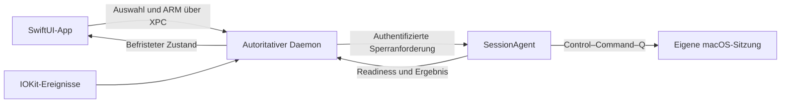

# Pullock

**Pull the key. Lock the Device.**

Pullock wird eine native macOS-Menu-Bar-App für einen physischen USB-Killswitch. Die App erkennt beobachtbare, kompatible USB-Geräte verschiedener Hersteller: USB-Sticks und andere USB-Devices. Du wählst eines aus und schaltest Pullock ausdrücklich scharf; sobald genau dieses Gerät getrennt wird, soll Pullock eine Sitzungssperre anfordern. Inhalte, Dateien und Credentials des Geräts werden nicht gelesen. Ein bestimmter Hersteller oder eine Seriennummer sind für diesen Modus nicht erforderlich.

> **Entwicklungsstand 0.4.1: integrierter automatischer Sperrtest, noch kein qualifiziertes Schutzprodukt und kein öffentlicher App-Release.** Nach Einrichtung signierter, freigegebener Dienste und ausdrücklichem ARM kann die App echte Sperranforderungen auslösen. Builds, Selbstdiagnosen und automatisierte Tests aktivieren diesen Weg nicht. Die erste fertige App wird erst nach den verbleibenden Hardware- und Distributionsprüfungen veröffentlicht.

## Was bereits funktioniert

| Bestandteil | Nachweisstand |
| --- | --- |
| Zustandskern | 41 Tests; Auswahl an Boot/Watcher/Power gebunden, Health-Leases, Ereignisreihenfolge, verriegelte Trigger und getrennte Aktionsanforderungen |
| USB-Beobachtung | 20 Tests; passiver IOKit-Watcher, aktuelle Geräte verschiedener Hersteller, Auswahl einer einzelnen Verbindung und deren sichere Invalidierung |
| IPC | 32 Vertrag-/Signatur-/Rollen-/Budgettests; Protokoll v3 weist ältere Dienste vor dem Handshake ab |
| Native Dienste / Speicher | 52 Tests; reale anonyme NSXPC-Verbindungen, Signaturablehnung, Owner-Neuprüfung, Limits, Speicherhärtung, Aktions-Deduplizierung und unabhängiger Session-Watchdog |
| Daemon-Laufzeit | 21 Tests; Inventare, Power-/Session-Grenzen, abbrechbare Zustellung und vollständige Auswahl→ARM→Removal→XPC→Mock-Aktion→Ergebnis-Kette |
| Sperrkurzbefehl | 5 Mock-Tests; öffentlicher Control–Command–Q-Adapter, Berechtigungs-/Sitzungsprüfung und Tastaturlayout-Auflösung |
| Hardware-Probe | 8 Tests; passive Diagnose, bereinigte Reports, keine echten Aktionen |
| App und eingebettete Helfer | Debug-/Release-Builds; Selbstdiagnosen, Signatur- und Importprüfung; feste Launch-Definitionen |

Die **179 automatischen Tests** führen keine echten Sperren, Shutdowns, Gerätebefehle oder Dienstregistrierungen aus. Native anonyme XPC-Tests ersetzen keine Prüfung installierter, separat laufender Produktionsdienste.

## So ist der Killswitch vorgesehen

1. USB-Gerät anschließen und seine aktuelle Verbindung in Pullock auswählen.
2. Erforderliche Dienste und macOS-Eingabeberechtigung einrichten; den Sperrweg bewusst testen.
3. Bei gültigem Systemzustand den Killswitch aktivieren.
4. Beim Ende der gewählten USB-Verbindung Control–Command–Q anfordern.

Die Auswahl wird **nicht dauerhaft gespeichert**. Abziehen, Sleep, Sitzungs-/Watcher-Wechsel und Neustart erfordern eine neue Auswahl und ausdrückliche Aktivierung. Ein gleiches Modell oder dasselbe Gerät nach erneutem Einstecken ersetzt die alte Verbindung nicht.

Der manuelle Test meldet nach Event-Übergabe **„Lock requested“ / „Sperre angefordert“**. Die automatische Kette zeigt **„Lock outcome unknown“**, solange keine tatsächliche Sperre bestätigt werden kann; auch ein Transportfehler lässt den Ausgang offen. Die verwendete öffentliche API bestätigt nicht, dass macOS gesperrt hat. Das muss beim realen Test am Sperrbildschirm und der anschließenden normalen Authentisierung überprüft werden.

[Die vom Nutzer bestätigte Produktentscheidung](docs/decisions/0003-connection-switch-and-shortcut.md) ersetzt frühere Planannahmen zu einer zwingenden YubiKey-Seriennummer und zur Wahl des Sperrwegs.

## Entwicklung

Voraussetzungen: Apple Silicon, macOS 27.x, Xcode 27 / Swift 6.4. Das generierte Xcode-Projekt ist versioniert. XcodeGen wird nur nach Änderungen an `project.yml` benötigt.

```sh
bash tools/validation/check.sh
```

Der gemeinsame lokale/CI-Ablauf testet die Packages, baut drei Targets in Debug und Release und prüft die ausführbaren Dateien einschließlich eingebetteter Helfer. Build-Artefakte liegen in einem ausgegebenen temporären Verzeichnis. Er öffnet keine App und löst keine Berechtigungsdialoge aus.

```text
packages/PullockCore/      Deterministischer Zustand und separates Simulationsprodukt
packages/PullockUSB/       Passiver USB-Watcher und aktuelle Verbindungsauswahl
packages/PullockIPC/       Nachrichten, Signaturen, Rollen und Limits
packages/PullockServices/  XPC, Policy-Store und getrenntes Daemon-Laufzeitprodukt
packages/PullockActions/   Öffentlicher Sperrkurzbefehl für App und SessionAgent
apps/macos/               SwiftUI-App, Agent, Daemon und Launch-Definitionen
tools/hardware-harness/  Passiver Hardware-Probe
tools/validation/        Gemeinsame Prüfung
tools/release/           Lokale Archive/Pakete, noch keine Veröffentlichung
```

Details: [Entwicklung](docs/development.md), [M4-/M5-Nachweis](docs/test-reports/M4-M5.md), [Release-Vorbereitung](docs/release/README.md).

## Architektur und Grenzen

Die Schutzkette trennt Oberfläche, sitzungsspezifischen Aktionsagenten und autoritativen Daemon. Der Entwicklungsdaemon beobachtet USB, Power und Konsolensitzung und bestätigt die flüchtige Geräteauswahl über authentifiziertes XPC. Ein geschlossenes Auswahlfenster stoppt diese Beobachtung nicht. Die separate lokale USB-Diagnose bleibt ohne Dienstinstallation verfügbar. Die Registrierung erfolgt nur über einen ausdrücklichen UI-Schritt und die macOS-Freigabe. Ein registrierter oder erreichbarer Dienst bedeutet noch keinen funktionierenden Schutz.



Nur der SessionAgent und der getrennte manuelle App-Test verwenden den Eingabeadapter. Der Root-Daemon linkt weder Eingabe- noch Shutdown-Adapter. Ein eindeutig authentifizierter Agent, aktive Owner-Sitzung, Berechtigungs-/Layout-Prüfung, aktuelle Inventare und frische Health-Leases sind Voraussetzung für ARMED. Bei Verlust einer zuvor gesunden Kette kann eine Sperranforderung folgen. Ein unabhängiger Agent-Watchdog merkt sich ausschließlich authentifizierte, frische ARMED-Leases. Lokale Sleep-/Session-Grenzen löschen diese Berechtigung; verspätete Antworten derselben Scharfschaltung stellen sie nicht wieder her.

Alle Trigger bleiben bis zum ausdrücklichen Reset verriegelt. Der Rückkanal bindet Aktionen an Boot, Nonce, Sequenz, Action-ID und Ablauf. Unsichere Zustellungen werden nicht automatisch wiederholt. Protokoll v3 verlangt zusammenpassende App-, Daemon- und Agent-Versionen; alle eingebetteten Komponenten müssen gemeinsam aktualisiert werden.

- IORegistry-Terminierung beweist das Ende einer beobachteten Verbindung, nicht den mechanischen Grund. Hub-/Bus-Resets können dieselbe Wirkung haben.
- Der Systemkurzbefehl setzt Eingabeberechtigung, geeignete Sitzung und Tastaturkonfiguration voraus. Umkonfigurierte Systemshortcuts und Systemstörungen müssen praktisch berücksichtigt werden.
- Gerät und Mac können gemeinsam entwendet werden, ohne dass die Verbindung endet. Pullock ersetzt keine macOS-Authentisierung, FileVault oder Datensicherung.
- Root-/Kernel-Kompromittierung, vollständig eingefrorene Rechner und kompromittierter vertrauenswürdiger Code liegen außerhalb einer durchsetzbaren Schutzgarantie.
- Optionaler Shutdown bleibt ein später zu qualifizierender Modus. Er ist derzeit nicht implementiert oder getestet; ein Live-Shutdown wird durch keinen Build-/Testbefehl ausgelöst.

Vor Freigabe fehlen reale Removal-/Lock-/Power-/Session-Tests der integrierten Aktionskette sowie vollständige Dienstinstallation, Update und Uninstall. Der direkte Xcode-Export von **0.4.1, Build 4** besteht Developer-ID-Signierung, exakte XPC-Signieranforderungen, gültiges Notarisierungsticket und Gatekeeper-Prüfung. Die App ist auf dem Entwicklungs-Mac unter `/Applications` installiert und gestartet; die drei installierten Binaries bestehen ihre harmlosen Selbsttests. Die installierte Dienstverbindung und tatsächliche Sperre bleiben zu prüfen. Der [Abnahmebericht](docs/test-reports/M5-live-check.md) trennt diese Nachweise. Der Kommandozeilenexport meldet weiterhin `No Accounts`; der funktionierende Organizer-Weg ist bestätigt.

## Bewusster Test auf einem Entwicklungs-Mac

1. Den aktuellen Quellstand prüfen und eine signierte, notarisierte Entwicklungs-App vorbereiten. Ein ad-hoc-Build kann die authentifizierten installierten Dienste nicht ersetzen.
2. App unter `/Applications` ablegen, Dienste über die App registrieren und in macOS freigeben. Beide Statusanzeigen prüfen.
3. Hintergrundverbindung herstellen und unter „Background services“ → „Request session agent permission“ die Eingabeberechtigung aus dem SessionAgent anfordern. Den macOS-Dialog beziehungsweise die Accessibility-Einstellungen abschließen. Der separate manuelle App-Test prüft nur den App-Prozess; seine Berechtigung beweist keine Berechtigung des Agenten.
4. Hintergrundverbindung herstellen, genau ein USB-Gerät auswählen und die Voraussetzungen prüfen. **„Arm and enable real lock requests“** aktiviert den echten Test bewusst.
5. Gewähltes Gerät entfernen, Sperrbildschirm und normale Entsperrung prüfen. Auch Monitor-/Dienstfehler können bei scharfgeschaltetem Test eine Sperranforderung auslösen.
6. Trigger zurücksetzen und vor Beenden oder Entfernen der Dienste disarmen. Nach Replug, Sleep oder Sitzungswechsel die aktuelle Verbindung neu auswählen.

Diese Schritte sind manuelle Qualifikation und werden durch keinen Testbefehl ausgeführt. Der permanente Produkt-Overlay, das vollständige Onboarding und Shutdown bleiben weitere Meilensteine. Die lokale Erkennungsansicht und Browser-Demo sind keine Schutzanzeige.

## Website und Distribution

Die statische Next.js-Website liegt unter `apps/web`: Startseite, Ablauf, Kompatibilität, Sicherheit, Datenschutz, Support, Release-Status und Impressum. Der Nutzer hat zunächst die GitHub-Pages-Adresse `https://koljasagorski.github.io/pullock.app/` gewählt. Der Pages-Workflow prüft den Export vor jeder Veröffentlichung; die eigene Domain bleibt ein späterer Schritt. Downloads werden als GitHub Releases dieses Repositorys bereitgestellt, sobald die App ihre Funktions- und Distributionsprüfungen besteht. Es gibt noch keinen Download eines fertigen Schutzprodukts.

Die Website wird aus demselben Repository mit Next.js, TypeScript und Tailwind statisch exportiert. Sie benötigt keinen Serverprozess und nutzt lokale Fonts/Assets. Änderungen an `apps/web` durchlaufen Typecheck, Lint, Build und Chromium-/WebKit-Prüfungen, bevor GitHub Pages veröffentlicht. Lokal: im Verzeichnis `apps/web` zuerst `npm ci`, dann `npm run dev`; der vollständige Ablauf steht in der [Website-README](apps/web/README.md).

Das vom Nutzer bereitgestellte Logo und der Slogan sind in die native App übernommen. Die [Brand-Assets](assets/brand/README.md) enthalten beide Farbschemata, App-Icons und vorbereitete Website-Favicons. Anbieter ist gemäß Nutzerangabe [patchletter UG (haftungsbeschränkt)](https://patchletter.com/de/impressum); die Daten für das Pullock-Impressum sind [dokumentiert](docs/brand-owner.md).

Der lokale Review-Packager erzeugt App-/Source-Archive, Manifest und SHA-256-Prüfsummen. Er veröffentlicht nichts. Der separate Archivhelfer kann mit einem vorhandenen Apple-Zertifikat signieren und optional Xcodes Developer-ID-Export anstoßen; er führt keine Notarisierung oder Veröffentlichung aus.

## Daten und Beiträge

Der native Entwicklungsstand benötigt keinen Account und keine Cloud; er enthält keine Telemetrie. USB-Deskriptoren, die gewählte Verbindung und Health-Zustand werden lokal verarbeitet. FIDO2, WebAuthn, PIV, OTP und Dateien auf USB-Sticks werden nicht angesprochen. Daraus folgt noch kein praktisch qualifizierter Koexistenznachweis für jede Gerätekombination. Die Website hat einen eigenen Hosting-Datenfluss, beschrieben im [Datenschutz](https://koljasagorski.github.io/pullock.app/privacy/).

Fehlerberichte sollten OS-/App-Version, Hardwareverbindung und reproduzierbare Schritte nennen. Keine Seriennummern, Schlüssel, Passwörter oder privaten Diagnosen ungeprüft in öffentliche Issues kopieren. Änderungen an Reducer, IPC und Aktionsausführung benötigen passende Regressionstests; CI darf niemals reale Eingaben oder Shutdowns auslösen. Sicherheitsrelevante Abweichungen und verbleibende Grenzen gehören in den Testbericht.

## Lizenz

Es gilt der vorhandene GPL-v3-Lizenztext in [LICENSE](LICENSE). Source und Lizenz gehören zur Distribution. Pullock ist ein unabhängiges Projekt; YubiKey ist eine Marke von Yubico. Eine Unterstützung oder Partnerschaft wird nicht behauptet.

Historischer Architektur-/Abnahmeplan: [PLAN.md](PLAN.md). Maßgeblich für geänderte Produktannahmen sind die verlinkten neueren Entscheidungen und aktuellen Testberichte.
