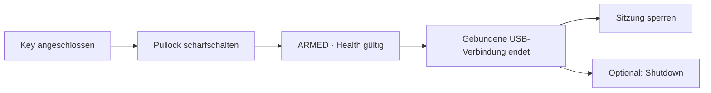
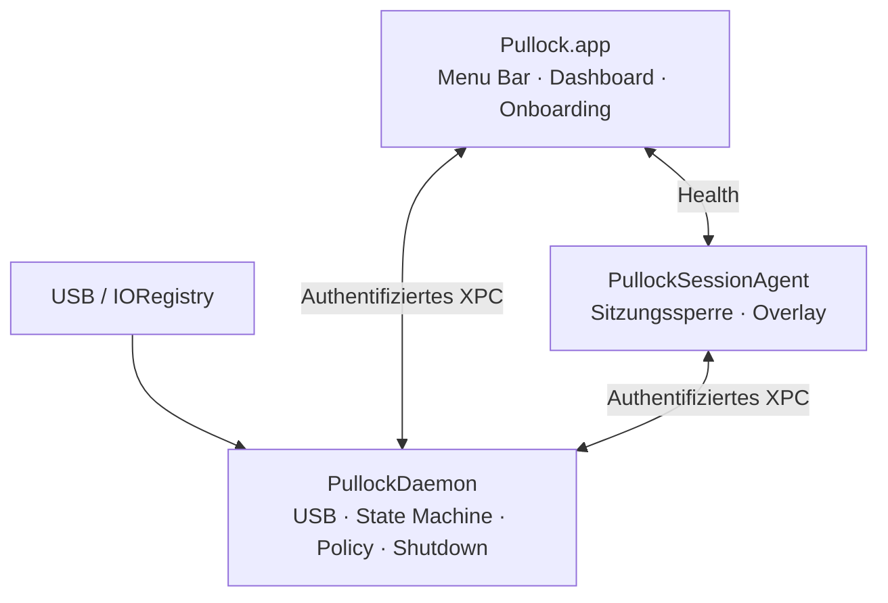
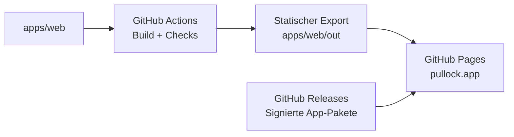

# Pullock

**Pull the key. Lock the Mac.**

Pullock soll einen bereits vorhandenen USB-Security-Key zum physischen Auslöser für die Sicherheit deines Macs machen: Key einstecken, Schutz aktivieren, Key entfernen — macOS sperrt die Sitzung und fährt auf Wunsch zusätzlich herunter.

Geplant als native macOS-App in Swift, SwiftUI und AppKit. Lokal, ohne Account und ohne Cloud-Abhängigkeit. Der erste Fokus liegt auf YubiKeys; die vorhandene FIDO2-, WebAuthn-, Passkey-, PIV-, OTP- und SSH-Nutzung soll beim Monitoring unbeeinträchtigt bleiben.

> **Projektstatus: M3 — passive USB-Beobachtung und Enrollment-Prüfung implementiert.** Zustandskern, IPC-Verträge, eine native Diagnose-/Simulations-App und Agent-/Daemon-Hüllen sind vorhanden. **83 Tests sowie Debug-/Release-Builds bestehen lokal.** M4-Rollen- und Verbindungsregeln sind vorbereitet; die Dienstintegration steht aus. Es gibt noch keinen Live-Schutz, Download oder Website. Sperrweg und dauerhafte Key-Identität bleiben offene Gates. Siehe [M3-Bericht](docs/test-reports/M3.md) und [Entwicklungsleitfaden](docs/development.md).

## Inhalt

- [Projektstand](#projektstand)
- [Produktidee](#produktidee)
- [Geplante Funktionen](#geplante-funktionen)
- [Architektur](#architektur)
- [Status und Health](#status-und-health)
- [Sicherheitsgrenzen](#sicherheitsgrenzen)
- [Kompatibilitaet](#kompatibilitaet)
- [Website und GitHub Pages](#website-und-github-pages)
- [Grafiken und Design](#grafiken-und-design)
- [Repository und Entwicklung](#repository-und-entwicklung)
- [Tests und Diagnostics](#tests-und-diagnostics)
- [Roadmap](#roadmap)
- [Distribution](#distribution)
- [Mitwirken](#mitwirken)
- [Lizenz und Marken](#lizenz-und-marken)

## Projektstand

| Bereich | Stand |
| --- | --- |
| Architektur, Threat Model, Sicherheitsentscheidungen | In [PLAN.md](PLAN.md) ausgearbeitet; Start von M1 freigegeben |
| Native macOS-App | SwiftUI-Entwicklungs-App mit passiver Geräteansicht und sechs bezeichneten Simulationen; produktive Oberfläche offen |
| Zustandskern / IPC-Vertrag | Swift-Packages mit 60 Tests; Signatur-/Rollen-/Verbindungsregeln vorbereitet, echte XPC-Dienstintegration offen |
| Agent / Daemon | Kompilierbare Entwicklungshüllen, keine installierten Dienste |
| Native CI | Sicherer Build-/Test-Workflow; M2- und M3-Läufe auf GitHub erfolgreich |
| USB- und Geräteidentifikation | Gemeinsamer IOKit-Watcher und strikte Enrollment-Prüfung; früher erkannter Key ohne passive Seriennummer; Hardwarequalifikation offen |
| Sofortige Sitzungssperre | Öffentliche API-/SDK-Prüfung und ungefährlicher Preflight; tragfähiger Lock-/Bestätigungspfad weiterhin offen |
| Privilegierter Shutdown | Systemweg bewertet, noch nicht implementiert oder praktisch getestet |
| Marketing-Website | Geplant im selben Repository unter `apps/web` |
| Hosting | GitHub Pages festgelegt; noch nicht eingerichtet |
| Zieldomain | `pullock.app` |
| Download / Release | Noch nicht verfügbar |

Die Produktfunktionen dieser README sind weiterhin geplant. Implementiert sind die M1-Untersuchung, die sichere M2-Entwicklungsbasis und der M3-Softwareaufbau. Die reale M3-Hardwarequalifikation steht noch aus. Der Auftrag „immer weiter“ erlaubt die weitere sichere Implementierung; fachliche Schutz- und Release-Gates bleiben bestehen. [PLAN.md](PLAN.md) enthält Architektur und Abnahmekriterien; [API-Entscheidungen](docs/decisions/0001-m1-feasibility.md), [Supportmatrix](docs/compatibility/M1.md) und [Testbericht](docs/test-reports/M1.md) halten den tatsächlichen Nachweisstand fest.

## Produktidee

**Key in. You’re safe. Key out. Mac locked.**

Pullock richtet sich an den Moment, in dem der Nutzer seinen Mac unmittelbar sperren möchte, ohne ein Menü oder eine Tastenkombination zu bedienen. Die physische Verbindung eines bewusst registrierten Keys dient als Auslöser.

Der vorgesehene Ablauf:

1. Einen kompatiblen USB-Key anschließen und in Pullock registrieren.
2. Erforderliche Systemkomponenten freigeben und einen sicheren Funktionstest durchführen.
3. Den gewünschten Modus wählen und Pullock bewusst scharfschalten.
4. Den registrierten Key entfernen, um die Schutzaktion auszulösen.



Der Key bleibt ein normaler Security-Key. Pullock soll seine USB-Anwesenheit beobachten, ohne Credentials zu lesen, Key-Konfigurationen zu verändern oder Authentisierungsinterfaces exklusiv zu belegen. Diese Koexistenz ist vor Veröffentlichung praktisch zu testen.

## Geplante Funktionen

| Funktion | Vorgesehenes Verhalten |
| --- | --- |
| Menu-Bar-App | Schutzstatus, Key, Modus, Arm/Disarm und Zugriff auf Settings |
| Dashboard | Ein gemeinsamer Zustand mit echten Health-Prüfungen aller Pflichtkomponenten |
| Eventbasierte USB-Erkennung | Native IOKit-Benachrichtigungen statt Shell-Polling |
| Primary-Key-Enrollment | Individuelle Identität und aktuelle Geräteinstanz; PID allein genügt nicht |
| Lock | Standardmodus; qualifizierte native Sitzungssperre |
| Lock + Shutdown | Sofortige separate Sperranforderung und privilegierter System-Shutdown |
| Security-Overlay | Kompakter Status über normalen Fenstern, optional auf allen Spaces und geeigneten Fullscreen-Oberflächen |
| Health Monitoring | Prüfung von App, Agent, Watcher, Daemon, IPC, Identität, Aktionspfad und Freshness |
| Sicheres Onboarding | Schrittweise Einrichtung, echte Freigabeprüfung und ungefährliche Standardtests |
| Diagnostics | Lokale strukturierte Ereignisse und bewusst exportierter bereinigter Report |

Für das MVP nicht vorgesehen: Account, Cloud, Telemetrie, Remote-Steuerung, automatische Entsperrung, NFC-Trigger oder mehrere gleichzeitig freigegebene Keys. Die Architektur soll spätere weitere USB-Key-Hersteller ermöglichen.

## Architektur

Die Schutzlogik soll unabhängig vom Hauptfenster arbeiten. Drei native Prozesse teilen klar begrenzte Aufgaben:



| Komponente | Geplante Technologie | Verantwortung |
| --- | --- | --- |
| Main App | Swift, SwiftUI, AppKit | Benutzeroberfläche und bewusste Konfiguration |
| SessionAgent | Swift, AppKit | Aktionen in der Benutzersitzung und Overlay |
| System-Daemon | Swift, IOKit, Foundation/Security | Autoritativer Zustandskern, USB-Events und eng begrenzte privilegierte Aktion |
| Dienstverwaltung | ServiceManagement / SMAppService | Registrierung und macOS-Freigabe der eingebetteten Dienste |
| Kommunikation | Authentifiziertes XPC | Feste Rollen, Signaturanforderungen und validierte Nachrichten |
| Website | Next.js, TypeScript, Tailwind CSS | Statischer Export für GitHub Pages |

Der Daemon erhält keine allgemeine Shell-API, keine frei wählbaren Programme und keine beliebigen Dateipfade vom Client. Der vorgesehene Shutdown-Executor darf ausschließlich den fest definierten Systemweg für einen gültigen Trigger oder einen ausdrücklich gestarteten Test verwenden.

Die vollständige Prozess-, Privilege-, IPC-, Power- und Konfigurationsarchitektur steht in [PLAN.md](PLAN.md). Dort werden auch die Gründe für den kleinen root-seitigen Watcher und die verbleibenden Ausfallgrenzen erklärt.

## Status und Health

Alle Oberflächen sollen denselben zentralen Zustand anzeigen. Grün wird ausschließlich aus einem frischen, gültigen Gesamtzustand abgeleitet.

| Anzeige | Bedeutung |
| --- | --- |
| Grün · **ARMED** | Richtiger Key gebunden, Trigger aktiv, Pflichtkomponenten und qualifizierter Aktionspfad gesund |
| Gelb · **DISARMED** | Schutz bewusst ausgeschaltet, Komponenten funktionsfähig |
| Orange · **WAITING** | Schutzabsicht vorhanden; Key oder erwartete Start-/Wake-Voraussetzung fehlt |
| Rot · **ERROR** | Sicherheitsrelevante Komponente fehlerhaft oder Health unbekannt/veraltet |

**TRIGGERED** ist ein zusätzlicher verriegelter Zustand: Die Schutzaktion wurde beschlossen. Schnelles Wiedereinstecken darf sie nicht abbrechen. Das Entfernen des Keys ist selbst kein roter Fehlerzustand.

Wichtige Regeln:

- Ein Start ohne Key löst keine Entfernung und keinen Shutdown aus.
- Vor einem Removal-Trigger muss innerhalb der aktuellen Scharfschaltung ein positiver Presence-Nachweis existieren.
- Ein reiner Heartbeat-Ausfall verursacht keinen automatischen Shutdown.
- Sleep/Wake verwirft veraltete Presence-Nachweise und erfordert neue Prüfung.
- Ein Request gilt erst nach bestätigtem Zustandswechsel als erfolgreich; die Oberfläche zeigt kein optimistisches ARMED.
- Ein erfolgreicher IPC-Aufruf beweist noch keinen tatsächlich gesperrten Bildschirm.

## Sicherheitsgrenzen

Pullock ist kein Diebstahlschutz und ersetzt weder FileVault noch die native macOS-Authentisierung. Wenn Key und Mac verbunden bleiben, fehlt der physische Auslöser.

Vor einer Veröffentlichung sind drei zentrale Fragen zu lösen:

**Sitzungssperre:** Ein verlässlicher öffentlicher Lock-Pfad einschließlich eines ehrlichen Erfolgskriteriums muss nachgewiesen werden. Ein schwarzes Fenster, ausgeschalteter Bildschirm oder gestarteter Screensaver ist kein Ersatz. Private APIs werden nicht stillschweigend zur Produktbasis.

**Individuelle Geräteidentität:** VID/PID beschreiben keine individuelle Instanz. Seriennummern müssen tatsächlich passiv verfügbar und stabil sein. Bei fehlender Kennung darf Pullock nicht behaupten, einen bestimmten YubiKey dauerhaft wiederzuerkennen. USB-Deskriptoren bleiben außerdem nachahmbar und sind keine kryptografische Attestation.

**Reset und Removal:** Eine terminierte USB-Service-Instanz kann auch durch Hub- oder Bus-Probleme entstehen. Sofortiges Shutdown bei jedem Verbindungsverlust und ein vollständiger Ausschluss von Fehlshutdowns sind deshalb kein belastbares gemeinsames Versprechen. Lock ist der geplante Default; der destruktive Modus benötigt eine bewusste Wahl und qualifizierte Betriebsbedingungen.

Ein erzwungener Shutdown kann ungespeicherte Daten verlieren. Ein erfolgreicher vorheriger Lock muss bei Shutdown-Fehler bestehen bleiben. Diese Eigenschaft kann erst nach Lösung und Prüfung des Lock-Pfads zugesagt werden.

Root-/Kernel-Kompromittierung, ein vollständig eingefrorenes Betriebssystem und deskriptoridentische USB-Spoofs liegen außerhalb der vorgesehenen Abwehr. Ein angehaltener Overlay-Prozess kann sein letztes Bild nicht selbst aktualisieren; die Statusanzeige ist kein manipulationssicheres Hardware-Signal.

Die detaillierte Bedrohungsmatrix und Gegenmaßnahmen sind in [PLAN.md](PLAN.md) dokumentiert.

## Kompatibilitaet

**Noch keine Hardwarekombination ist freigegeben.**

M1 erkennt lokal einen angeschlossenen Yubico-Key mit VID/PID `1050:0407`. In den geprüften Registry-Feldern fehlt die Seriennummer, `iSerialNumber` ist `0`. Diese Beobachtung ist keine Modell-/Firmware- oder Kompatibilitätsfreigabe und reicht nicht für das geplante dauerhafte spezifische Enrollment. Einzelheiten stehen in der [M1-Supportmatrix](docs/compatibility/M1.md).

| Bereich | Geplantes erstes Ziel |
| --- | --- |
| Architektur | Apple Silicon / arm64 |
| Geräte | MacBook Air und MacBook Pro |
| Betriebssystem | Aktuelles stabiles macOS 27.x |
| Security-Keys | Zunächst ausgewählte YubiKey-Modelle und USB-Interface-Konfigurationen |
| Verbindung | USB; Direktverbindung zuerst, Hubs/Docks nur nach eigener Qualifikation |

Eine spätere Supportmatrix nennt Modell, Firmware-/Interface-Konfiguration, verfügbare Identität, macOS-Version, Anschlusstopologie und Prüfergebnis. Die bloße Verfügbarkeit einer API auf älteren Systemen gilt nicht als Supportnachweis.

Weitere Hersteller, ältere macOS-Versionen, Backup-Keys und Mehrbenutzerszenarien benötigen eigene Entscheidungen und Tests. Das Projekt verspricht keine allgemeine Kompatibilität mit jedem Produkt, das „Security Key“ heißt.

## Website und GitHub Pages

Die Marketing-Website wird **im selben Repository** unter `apps/web` entwickelt und auf **GitHub Pages** veröffentlicht. Die Zieldomain lautet `pullock.app`. Native App und Website erhalten eine gemeinsame visuelle Sprache.

Geplanter Veröffentlichungsweg:



Next.js wird mit statischem Export eingesetzt. Die Website benötigt keinen Node-Server im Betrieb. Serverseitige Laufzeitfunktionen, Server Actions und dynamische API-Endpunkte gehören daher nicht zu dieser Architektur. Der Pages-Workflow veröffentlicht den geprüften Export; App-Downloads liegen in GitHub Releases desselben Projekts.

Custom Domain, DNS, HTTPS und statische Pfade werden im Website-/Release-Meilenstein eingerichtet und geprüft. Ein vorübergehender Projektseiten-Pfad und die eigene Domain erhalten passende Buildkonfigurationen. Derzeit ist weder eine Pages-Site eingerichtet noch ein Deployment-Workflow vorhanden. Die technischen Einzelheiten folgen den [GitHub-Pages-Workflows](https://docs.github.com/en/pages/getting-started-with-github-pages/using-custom-workflows-with-github-pages) und der [Next.js-Dokumentation zum statischen Export](https://nextjs.org/docs/app/guides/static-exports).

Geplante Inhalte:

- Hero: „Pull the key. Lock the Mac.“ mit einer hochwertigen Produktvisualisierung.
- „How it works“ mit Einstecken, Scharfschalten und Entfernen.
- Erklärung des Status-Overlays und der tatsächlichen Health-Kette.
- Kompatibilitätsseite mit geprüften Modellen und bekannten Einschränkungen.
- Privacy, Security, sichere Tests, Support und Release Notes.
- Download mit tatsächlicher Version, Voraussetzungen und signiertem Artefakt, sobald verfügbar.

Keine Tracking-SDKs, erfundenen Bewertungen oder behaupteten Partnerschaften. Die native Schutzfunktion braucht keine Verbindung zu GitHub oder zur Website. Websitebesuche und bewusst heruntergeladene Updates sind davon getrennte Netzwerkzugriffe.

## Grafiken und Design

Benötigte Grafiken werden für Pullock erstellt und gemeinsam mit dem Produkt entwickelt:

- App-Icon, Menu-Bar-Symbole und konsistente Wort-/Bildmarke.
- MacBook-/Key-Produktdarstellung und nachvollziehbare Ablaufgrafiken.
- Overlay- und Health-Illustrationen aus den realen Statusregeln.
- Open-Graph-Bild, Favicons sowie passende helle und dunkle Varianten.

Vektoren eignen sich für präzise Icons und Diagramme; bei Bedarf entstehen generierte Produktillustrationen. Nach Implementierung liefern echte App-Screenshots den Funktionsnachweis. Generierte Konzepte werden nicht als Beleg für bereits existierende Funktionen verwendet.

Quellen, Nutzungshinweise und Exporte sollen unter `design/` dokumentiert werden. Optimierte Web-Assets und native Asset Catalogs erhalten die jeweils passenden Formate. Aktuell sind noch keine Produktgrafiken angelegt; sie entstehen in den freigegebenen UI-/Website-Meilensteinen.

## Repository und Entwicklung

Aktuell vorhanden:

```text
.
├── .gitignore
├── .gitattributes
├── LICENSE
├── PLAN.md
├── README.md
├── docs/                 Entscheidungen, Supportmatrix und Testberichte
├── packages/             PullockCore und PullockIPC
├── apps/macos/           Xcode-Projekt und native Entwicklungs-Targets
├── .github/workflows/    Native Build-/Test-Pipeline
└── tools/                Hardware-Probe und gemeinsamer Prüfablauf
```

Weitere geplante Aufteilung in den jeweiligen Meilensteinen:

```text
apps/macos/        Native App, SessionAgent, Daemon und Xcode-Projekt
apps/web/          Next.js-Website und statische Web-Assets
packages/         Testbarer Swift-Zustandskern und IPC-Verträge
design/           Grafikquellen, Exporte und Asset-Dokumentation
docs/             Architekturentscheidungen, Testberichte und Releases
tools/            Sichere Hardware-Testwerkzeuge und Releasewerkzeuge
.github/workflows/ Build-, Test- und Pages-Pipelines
```

Das Repository lässt sich bereits beziehen:

```sh
git clone https://github.com/koljasagorski/pullock.app.git
cd pullock.app
```

Das M1-Swift-Package lässt sich auf der lokal geprüften Toolchain (macOS 27.0, Xcode 27.0, Swift 6.4, arm64) bauen und testen:

```sh
export PULLOCK_PROBE_BUILD=$(mktemp -d "${TMPDIR%/}/pullock-probe.XXXXXX")
swift test --package-path tools/hardware-harness --scratch-path "$PULLOCK_PROBE_BUILD"
swift run --package-path tools/hardware-harness --scratch-path "$PULLOCK_PROBE_BUILD" pullock-probe inspect
```

Das temporäre Buildverzeichnis vermeidet Finder-/File-Provider-Metadaten, die lokal die Testbundle-Signierung im Projektordner gestört haben. Weitere Befehle und der harmlose USB-Test stehen in der [Werkzeuganleitung](tools/hardware-harness/README.md). Das [Xcode-Entwicklungsprojekt](apps/macos/Pullock.xcodeproj) und der [gemeinsame Prüfablauf](docs/development.md) ergänzen die Probe. Ein Produktionsrelease und ein Web-Package fehlen weiterhin.

Geprüfte zusammenhängende Änderungen werden regelmäßig committed und zu GitHub gepusht. README und Plan bleiben dabei aktuell. Es gibt keine Force-Pushes zum Überschreiben fremder Änderungen. Ein Push von Dokumentation ersetzt weder eine Meilensteinfreigabe noch den Nachweis einer implementierten Funktion.

## Tests und Diagnostics

Automatisierte Tests dürfen niemals den Entwicklungs-Mac herunterfahren oder ungefragt sperren. Der geplante Kern arbeitet deshalb mit austauschbaren Eventquellen, einer injizierbaren Clock und Mock-Aktionen. Reale Systemaktionen bleiben in getrennten, ausdrücklich gestarteten Testabläufen.

Die Teststrategie umfasst:

- Deterministische State-Machine-Tests für Startup, Arming, Removal, Reconnect und konkurrierende Ereignisse.
- USB-Identitätsprüfung mit PID-Wechsel, mehreren Keys und fehlenden oder duplizierten Kennungen.
- XPC-Tests gegen falsche Signaturen, Rollen, Benutzer, Payloads und veraltete Requests.
- Ausfalltests für App, Agent, Daemon, Watcher, Berechtigungen und hängende Verarbeitung.
- Sleep/Wake, Display-Sleep, Sessionwechsel, Hubs, Docks und Bus-Resets auf echter Hardware.
- Koexistenz mit FIDO2/WebAuthn, Passkeys, PIV, OTP und SSH.
- Manuell bestätigte Lock-/Shutdown-Proben auf einem dafür vorbereiteten Test-Mac.
- Websiteprüfungen für Build, statische Pfade, Links, Accessibility, Browserdarstellung und Performance.

Latenzmessungen unterscheiden mechanisches Abziehen, OS-Event, Triggerentscheid, Lock-Anforderung und tatsächlich erfolgte Sperre. Interne Zeitstempel allein beweisen keine physische End-to-End-Latenz.

Diagnostics bleiben lokal. Ein bewusst exportierter Report soll Versionen, Health-Ursachen und bereinigte Ereignisse enthalten, jedoch keine Credentials, PINs oder unmaskierten Gerätekennungen. Es gibt keinen geplanten automatischen Upload.

**83 Swift-Tests bestanden** (36 Kern-, 24 IPC-, 15 USB-, 8 Probe-Tests), außerdem Debug-/Release-Builds, native Selbstprüfungen und die bereits dokumentierten passiven M1-Beobachtungen. Die Tests betreffen die Diagnose, nicht eine fertige Schutzanwendung. Hardwarequalifikation, tatsächliche Sitzungssperre und Shutdown sind damit nicht nachgewiesen. Die Berichte zu [M1](docs/test-reports/M1.md), [M2](docs/test-reports/M2.md), [M3](docs/test-reports/M3.md) und der [M4-Vorbereitung](docs/test-reports/M4-preparation.md) enthalten Befunde und offene Prüfungen.

## Roadmap

| Meilenstein | Ziel | Stand |
| --- | --- | --- |
| M0 | Architekturplan, ausführliche README, GitHub-Synchronisierung | Plan für den Start von M1 freigegeben |
| M1 | Lock-, Identitäts-, USB-/Power-Machbarkeit | Diagnosewerkzeug und Tests vorhanden; Lock-/Identitäts-Gates offen |
| M2 | Zustandskern und sichere Testbasis | Implementiert; 55 sichere Tests und native Builds lokal bestanden |
| M3 | USB-Watcher und Enrollment | Software implementiert; reale Hardwarequalifikation offen |
| M4 | SMAppService, authentifiziertes XPC und Health | Rollen-/Verbindungsregeln vorbereitet; Listener, Dienste und Systemtests offen |
| M5 | Qualifizierte Sitzungssperre | Geplant, Release-Gate |
| M6 | Optionaler privilegierter Shutdown | Geplant, abhängig von M5 |
| M7 | Native Oberfläche, Overlay und App-Grafiken | Geplant |
| M8 | Ausfallhärtung, Diagnostics und Hardwarequalifikation | Geplant |
| M9 | Website, eigene Visuals und GitHub-Pages-Workflow | Geplant |
| M10 | Signierte Distribution, GitHub Releases und Veröffentlichung | Geplant |

Nach jedem Meilenstein werden Build, passende Tests, Fehlerbehebung, geänderte Dateien und verbleibende Risiken dokumentiert. Der anschließende Auftrag „immer weiter“ autorisiert die fortlaufende sichere Implementierung; echte Systemaktionen und Release-/Schutzfreigaben behalten ihre eigenen Voraussetzungen. Details und konkrete Abnahmekriterien stehen in [PLAN.md](PLAN.md).

## Distribution

Die native App soll direkt verteilt werden: Developer-ID-signiert, mit Hardened Runtime und Apple-Notarisierung. Ein signiertes Paket mit konsistentem Installationsort wird bevorzugt. Die Systemdienste benötigen die vorgesehene macOS-Freigabe; ihre bloße Registrierung reicht nicht als Health-Nachweis.

Versionierte Installationspakete, Prüfsummen, Source-Material und Release Notes sollen über GitHub Releases verfügbar sein. Zum MVP sind manuelle Updates vorgesehen. Ein Update beendet die bisherige Schutzsession kontrolliert und verlangt nach erneuter Prüfung bewusstes Arming.

Die erste fertige App soll gemäß Nutzerauftrag als GitHub Release veröffentlicht werden. Die [Release-Vorbereitung](docs/release/README.md) enthält einen lokalen Packager für App, Source und Prüfsummen sowie den tatsächlichen Stand der offenen Bedingungen.

Es gibt noch keinen Installer. Anleitungen zum Deaktivieren von Gatekeeper oder Herabsetzen der macOS-Sicherheit sind kein vorgesehener Installationsweg.

## Mitwirken

Vor Änderungen am Sicherheitskern bitte [PLAN.md](PLAN.md) lesen. Sinnvolle frühe Beiträge sind reproduzierbare Erkenntnisse zu öffentlichen Apple-APIs, Geräteidentität und sicherer Testbarkeit.

Allgemeine Fehler oder Vorschläge können in den [Repository-Issues](https://github.com/koljasagorski/pullock.app/issues) beschrieben werden. Reports sollten OS-/App-Version, Modell, bereinigte Anschlusstopologie, Schritte und erwartetes Verhalten nennen. Keine PINs, Credentials, unbereinigten Diagnosen oder Seriennummern veröffentlichen.

Ein privater Meldeweg für Sicherheitslücken und eine `SECURITY.md` werden vor dem ersten ausführbaren Release eingerichtet. Bis dahin keine ausnutzbaren Sicherheitsdetails in öffentlichen Issues veröffentlichen und keinen noch nicht existierenden Kontaktweg voraussetzen.

## Lizenz und Marken

Das Repository enthält den Text der **GNU General Public License, Version 3** in [LICENSE](LICENSE). Die vorhandene Lizenz bleibt Grundlage der weiteren Repository-Arbeit; Release- und Source-Bereitstellung werden damit abgestimmt. Rechte und Nutzungshinweise für Grafiken sowie Drittbestandteile werden gesondert dokumentiert.

YubiKey ist eine Marke von Yubico. Pullock ist als unabhängiges Produkt geplant und behauptet keine offizielle Partnerschaft, Unterstützung oder Zertifizierung durch Yubico oder Apple.
